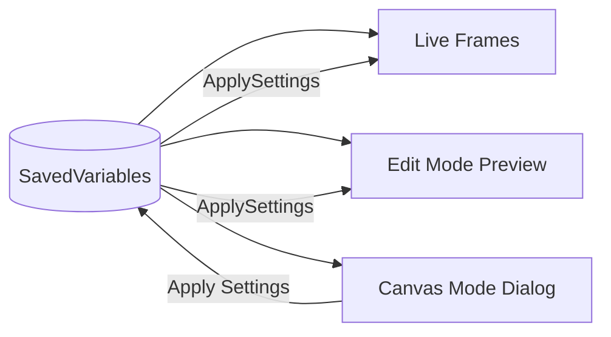
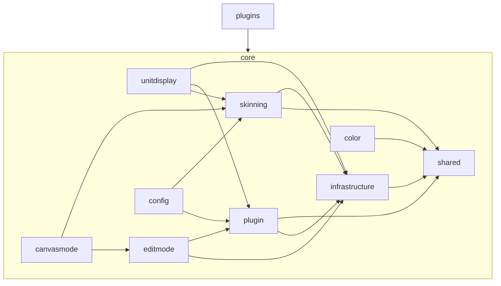
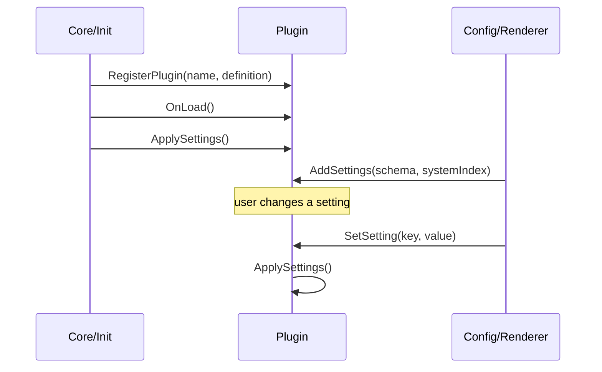

# contribute

how to contribute to orbit. read this before writing any code.

## project overview

orbit is a modular wow ui suite built on blizzard's native edit mode. the codebase follows domain-driven design with a plugin architecture. every feature is a plugin. every plugin depends on core. core never depends on plugins.

## three systems

orbit has three distinct rendering systems. contributors must understand the data flow between them.

| system | what it is |
|---|---|
| **live frames** | the real gameplay hud — what the player sees while playing |
| **edit mode** | blizzard's native layout editor — orbit builds preview frames that are clickable, draggable, and resizable |
| **canvas mode** | orbit's own dialog window — opens from edit mode for fine-tuning individual components within a single frame |

### data flow



- **savedvariables** are the single source of truth
- all three systems read from the same settings
- canvas mode "apply" writes back to savedvariables, which triggers `ApplySettings` on both edit mode previews and live frames simultaneously
- canvas mode "cancel" discards all pending changes — no writes

## architecture



dependencies flow **inward**. plugins depend on core. core never depends on plugins. plugins must never depend on other plugins.

## directory structure

```
Orbit/
  Core/
    Init.lua              -- bootstrap, plugin registration, saved variables
    API.lua               -- public api surface
    Infrastructure/       -- events, pixel math, combat, animation, async
    Plugin/               -- plugin lifecycle, profiles, mixins
    Shared/               -- constants, media registrations
    Color/                -- class/reaction color resolvers, color curve engine
    Skinning/             -- borders, textures, icons, cast bars, action buttons
    UnitDisplay/          -- shared unit frame mixins (health, auras, cast bars)
    EditMode/             -- blizzard edit mode integration (preview frames, selection, dragging, snapping)
    CanvasMode/           -- intra-frame component editor dialog (component drag, dock, viewport, overrides)
    Config/               -- schema builder, renderer, widgets, options panel
    Libs/                 -- third-party libraries
    assets/               -- textures and media
  Plugins/
    ActionBars/                 -- action bar containers and button layout
    BossFrames/                 -- boss encounter frames (1-8)
    CooldownManager/            -- cooldown viewers, charge bars, drag-injected items
    CooldownViewerExtensions/   -- shared side-tab registrar for blizzard's CooldownViewerSettings
    DamageMeter/                -- multi-instance damage / healing / interrupt meter on top of C_DamageMeter
    Datatexts/                  -- free-floating datatext system with corner-triggered drawer
    Extras/                     -- standalone plugins (TalkingHead, MinimapButton)
    GroupFrames/                -- unified party (1-5) and raid (6-40) frames with tiered layouts
    MenuItems/                  -- micro menu, bag bar, queue status
    Minimap/                    -- minimap and compartment with canvas-mode component placement
    StatusBars/                 -- experience / reputation / honor bars with canvas text components
    Tracked/                    -- user-authored tracked ability icons and bars
    UnitFrames/                 -- player, target, focus and sub-frames
```

each directory has its own `README.md`. read it before editing code in that directory.

## code standards

### style

- inline code aggressively. minimize loc.
- single-line comments only. no multi-line comment blocks.
- constants at file top. no magic numbers anywhere.
- divider format: `-- [ TITLE ] ---...` (no blank line after).
- files must not exceed ~1000 loc. decompose when approaching this.

### formatting

the project uses [stylua](https://github.com/JohnnyMorganz/StyLua) for auto-formatting:

| setting | value |
|---|---|
| column_width | 160 |
| indent_type | spaces |
| indent_width | 4 |
| quote_style | auto prefer double |
| syntax | lua 5.1 |
| line_endings | unix |

run `stylua .` from the project root before committing.

### principles

- **solid** — non-negotiable
- **dry** — by default. repeat only when dry would violate srp
- **no fallback code** — work once or fail fast
- **no defensive nil-chains** "just in case"
- **no memory leaks** — no wasted cycles, no o(n²) when o(n) exists
- **pixel-perfect** — all pixel offsets use `Pixel:Snap()` or `Pixel:Multiple()`

## plugin lifecycle

every plugin follows this sequence:



## adding a new plugin

1. create a new directory under `Plugins/` with the plugin name
2. create the main plugin file (e.g., `MyPlugin.lua`)
3. call `Orbit:RegisterPlugin("Orbit_MyPlugin", { ... })` with your plugin definition
4. implement `OnLoad()` and `ApplySettings()` methods
5. add settings via `AddSettings(schema, systemIndex)` if needed
6. add default settings in `Core/Plugin/DefaultProfile.lua`
7. create `Plugins/MyPlugin/MyPlugin.xml` listing every `.lua` file in dependency order, then reference that bundle from `Orbit.toc`. dependencies must load before consumers.

## common patterns

### settings

plugins declare settings as schemas using `SchemaBuilder`. the config system renders them automatically.

```lua
function plugin:AddSettings(schema, systemIndex)
    schema:AddTab("General")
    schema:AddSlider("iconSize", "Icon Size", 16, 64, 1)
    schema:AddCheckbox("showText", "Show Text")
end
```

widgets must be self-contained. config never calls plugin methods directly — it calls `plugin:SetSetting()` and the plugin reacts via `ApplySettings`.

### skinning

plugins never create visual elements directly. they call skinning methods:

- `Orbit.Skin:SkinBorder(frame, settings)` — borders
- `Orbit.Skin:SkinStatusBar(bar, settings)` — health/power bars
- `Orbit.Skin:SkinText(fontString, settings)` — text styling
- `Orbit.Skin.Icons:Apply(icon, settings)` — icon frames

skinning functions are **idempotent**. calling them twice with the same settings produces the same result.

### edit mode

to make a frame positionable in edit mode:

1. set `frame.anchorOptions` with allowed behaviors
2. call `OrbitEngine.Frame:AttachSettingsListener(frame, plugin, systemIndex)`
3. create a `CreateCanvasPreview` method on the frame

### canvas mode

to add fine-tuning of components within a frame:

1. register component creators in `CanvasMode/Creators/`
2. register via `OrbitEngine.CanvasMode.RegisterCreator(key, creatorFn)`
3. the creator receives the source component and returns a draggable preview
4. see `CanvasMode/Creators/Registry.lua` for the full pattern

### events

use the eventbus for cross-system communication:

```lua
Orbit.Engine.EventBus:Listen("ORBIT_PROFILE_CHANGED", function() ... end)
Orbit.Engine.EventBus:Fire("MY_CUSTOM_EVENT", data)
```

prefer `EventBus:Fire()` over direct function calls. inter-plugin communication must always go through the eventbus.

### unit display mixins

shared unit frame behaviors live in `Core/UnitDisplay/`. if two or more unit frame plugins share a behavior, it belongs there. one-off logic stays in the plugin.

mixins are **stateless**. state lives on the frame (`frame._mixinState`), never on the mixin table.

### colors

- color tables use `{ r, g, b, a }` format, never indexed arrays
- color resolvers are pure functions: `input -> { r, g, b, a }`
- the color curve engine is the only system that evaluates gradients

## where things go

| what | where |
|---|---|
| new engine-level system | `Core/Infrastructure/` |
| new shared unit frame behavior | `Core/UnitDisplay/` |
| new visual rendering logic | `Core/Skinning/` |
| new configuration widget | `Core/Config/Widgets/` |
| new color resolver | `Core/Color/` |
| new canvas mode component creator | `Core/CanvasMode/Creators/` |
| new constant | `Core/Shared/Constants.lua` |
| z-index / layer ordering | `Core/Shared/StrataEngine.lua` |
| new plugin | `Plugins/NewPlugin/` |
| new mixin | `Core/Plugin/` |
| edit mode frame behavior | `Core/EditMode/` |
| canvas mode component behavior | `Core/CanvasMode/` |

## preview parity

live frames, edit mode previews, and canvas mode all read from the same saved variables. the visual state must be consistent across all three:

- canvas (apply settings) → preview == live
- live → edit mode → preview frame → canvas mode

## submitting changes

1. fork the repository
2. create a branch from `main`
3. follow all code standards above
4. run `stylua .` before committing
5. test in-game
6. submit a pull request with a clear description of what changed and why
7. ensure your changes are thoroughly tested in-game, changes to core means test other downstream consumers
8. screenshots of what you have changed in the pull request
9. If backend changes and no visual user impact, set WhatsNew to disabled.
10. else Add WhatsNew description to Core/Config/WhatsNew.lua
11. <3

## communication

join the discord for discussion, bug reports, and feature suggestions:

[https://discord.gg/25mVxqGJh2](https://discord.gg/25mVxqGJh2)
