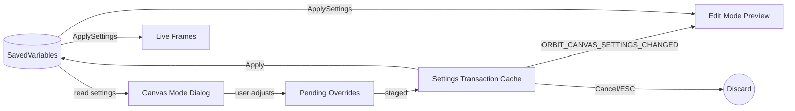

# canvas mode

orbit's intra-frame component editor. a separate dialog window for fine-tuning the position and styling of individual components within a single frame.

## purpose

when a user double-clicks a frame in edit mode, canvas mode opens a dialog window that renders all of that frame's internal components (text, icons, auras, cast bars) as draggable elements. the user can reposition components, adjust per-component overrides (font, size, color), dock/undock components, and zoom the viewport.

## data flow



canvas mode reads the same settings as live frames and edit mode. all changes are buffered as pending overrides and staged into the settings transaction cache. the transaction fires `ORBIT_CANVAS_SETTINGS_CHANGED` on each edit, allowing preview frames to live-update without touching saved variables. when the user hits "apply," the dialog writes settings directly to saved variables (the transaction has no commit step), clears the transaction, and triggers `ApplySettings` on both live frames and edit mode previews. cancel discards the transaction and restores preview frames to their pre-edit state.

## directory structure

```
CanvasMode/
  CanvasMode.xml          -- xml script bundle (load order)
  CanvasEdit.lua          -- canvas mode engine: enter/exit/toggle, selection tinting, background overlay
  ComponentRegistry.lua   -- component registration, drag mechanics, position callbacks, nudge
  ComponentHandle.lua     -- drag handle creation and pooling for components
  ComponentHelpers.lua    -- safe size/position utilities (WoW 12.0+ secret value handling)
  SnapEngine.lua          -- unified edge-magnet and grid-round snap logic
  SmartGuides.lua         -- visual snap feedback lines (edge/center alignment)
  OverrideUtils.lua       -- per-component override read/write helpers
  Init.lua                -- canvas mode initialization and constants
  SettingsTransaction.lua -- transactional cache for edit sessions (Begin/Rollback/Clear)
  Dialog.lua              -- main dialog window: open/close, tab filtering, frame selection
  DialogActions.lua       -- dialog button handlers (apply, reset, cancel)
  Viewport.lua            -- viewport controls (zoom, pan, sync toggle, preview switching)
  Dock.lua                -- disabled component dock (drag-to-disable, click-to-restore)
  CanvasModeTour.lua      -- guided tour explaining Canvas Mode features
  CanvasModeDrag.lua      -- intra-dialog component drag-and-drop
  ComponentSettings.lua         -- per-component settings core (open/close, value routing, layout)
  ComponentSettingsSchema.lua   -- schema definitions, presets, titles, type detection
  ComponentSettingsWidgets.lua  -- widget creation helpers (slider, checkbox, font, color)
  ComponentSettingsPreview.lua  -- preview renderers (portrait, cast bar, health text) + style applicators
  IconCanvasPreview.lua         -- icon-grid canvas preview helper (sized/styled draggable icons for Tracked, CooldownManager)
  Creators/               -- component creator registry (how to build draggable previews per type)
    Registry.lua
    AuraCreator.lua
    CastBarCreator.lua
    FontStringCreator.lua
    IconFrameCreator.lua
    PortraitCreator.lua
    StatusIconGroupCreator.lua
    TextureCreator.lua
```

## component settings controls

`ComponentSettings.lua` dispatches on each schema control's `type` (`slider`, `checkbox`, `dropdown`, `font`, `color`, `colorcurve`, `formatinput`). `formatinput` renders a `Label [ text box ]` (`Widgets.CreateFormatInput`) where the user types a format string directly — typed keys like `%` / `Current` / `CurrentK` / `Max` / `MaxK` become values, `&` splits the rest display from the mouseover display, and all other characters are literal text. The committed value is trimmed of leading/trailing whitespace. Hovering shows a tooltip of the available keys, built by `Schema.GetFormatTooltipLines(setName)` from `OrbitEngine.UnitButton.HEALTH_TOKENS` (UnitDisplay owns the canonical tokens + live formatters + the parser; canvas reads them as data). Invalid input (more than one `&`, or a value token repeated within a side — via `UnitButton.ValidateHealthFormat`) shows a red border and is not committed. The value is stored as the `HealthTextFormat` string; the live preview uses `UnitButton.HealthFormatRestSample`. A blank/whitespace string shows no value on the live frame (status text still shows — see UnitDisplay), and the Canvas Mode preview renders a localized `Status` placeholder (`CFG_FORMAT_STATUS`) so the component stays visible and selectable. For existing users the box is seeded from their legacy `HealthTextMode` via `UnitButton.LegacyHealthModeToFormatString` (e.g. `percent_short` → `"% & CurrentK"`), so no saved data is rewritten.

## plugin onboarding contract

### required plugin fields

| field | type | description |
|-------|------|-------------|
| `canvasMode` | `true` | enables canvas mode for this plugin. set on the plugin table. |

### optional plugin fields

| field | type | description |
|-------|------|-------------|
| `supportsGlobalSync` | `boolean` | multi-instance plugins (e.g. ActionBars) where one layout applies to all instances. enables the sync toggle UI. |
| `defaults.ComponentPositions` | `table` | default positions per component key. used by "reset positions" in canvas mode. |
| `defaults.DisabledComponents` | `table` | default disabled component keys. used by "reset positions". |
| `GetDefaultComponentPositions(self) → table\|nil` | `function` | dynamic alternative to `defaults.ComponentPositions`. plugins with context-scoped defaults (e.g. GroupFrames per-tier) implement this so "reset positions" picks up the right slice. takes precedence over `defaults.ComponentPositions`. |
| `GetDefaultDisabledComponents(self) → table\|nil` | `function` | same idea for `DisabledComponents`. |
| `canvasPreviewText` | `{[key] = string}` | per-key preview text shown in canvas mode. supplies realistic worst-case strings (e.g. `Name = "Tyrannothesaurus-Stormrage"`) so users can see how their layout handles long content and overlap. takes precedence over the live source text. |
| `GetCanvasPreviewText(self, key) → string\|nil` | `function` | functional alternative to `canvasPreviewText`. return nil to fall through to defaults. |

### lifecycle hooks (from PluginMixin)

these are already provided by `PluginMixin`. only override if you need plugin-specific behavior.

| hook | default behavior | when to override |
|------|------------------|------------------|
| `OnCanvasApply()` | calls `ApplySettings()` + `SchedulePreviewUpdate()` | group frames that delegate to `GroupCanvasRegistration` |
| `IsComponentDisabled(key)` | checks `DisabledComponents` setting (respects active transaction) | plugins with non-standard disabled storage (e.g. CooldownManager) |
| `GetComponentPositions(sysIdx)` | reads `ComponentPositions` (respects active transaction) | never — use the mixin default |

### settings contract

canvas mode reads and writes these settings keys per `systemIndex`:

| key | type | written by |
|-----|------|------------|
| `ComponentPositions` | `{[key] = {anchorX, anchorY, offsetX, offsetY, justifyH, posX, posY, baseSize?}}` | Apply |
| `DisabledComponents` | `{key, key, ...}` | Apply |
| `UseGlobalTextStyle` | `boolean` | Apply (sync toggle) |
| `GlobalComponentPositions` | same as ComponentPositions | Apply (when synced) |
| `GlobalDisabledComponents` | same as DisabledComponents | Apply (when synced) |

per-component overrides (font, size, color) are written via `ComponentSettings:FlushPendingPluginSettings()`.

`baseSize` is optional and present only for square icon previews that opt in via `preview.scalesTextWithSize` (set by `IconCanvasPreview` — Tracked, CooldownManager). it records the icon's authored width so `PositionUtils.ApplyTextPosition` can scale the stored offset by `currentIconSize / baseSize` — text on an icon then keeps its relative position when the icon is resized, instead of holding a constant pixel inset. all other components (unit frames, DamageMeter bars) omit it and keep fixed-pixel offsets, so existing layouts are unaffected.

### 4-step onboarding

1. **set the flag**: `Plugin.canvasMode = true` on your plugin table
2. **register components**: your plugin's `ApplySettings` must call `PositionUtils.ApplyTextPosition` or equivalent for each positioned component. canvas mode will generate position data that these functions consume.
3. **provide defaults** (optional): set `Plugin.defaults.ComponentPositions` and `Plugin.defaults.DisabledComponents` to enable the "reset positions" button.
4. **add a creator** (only if new component type): register a new creator type in `Creators/` and add it to `Creators/Registry.lua`. existing creators (Aura, CastBar, FontString, IconFrame, Portrait, StatusIconGroup, Texture) are the reference for the contract.

### component key naming

- PascalCase: `HealthText`, `CastBar`, `StatusIcons`
- sub-components use dot notation: `CastBar.Text`, `CastBar.Timer`
- aura containers: `Buffs`, `Debuffs`
- icons: `DefensiveIcon`, `CrowdControlIcon`, `PrivateAuraAnchor`

## rules

- canvas mode code may depend on edit mode infrastructure (`HandleCore`, `Pixel`), never on specific plugins
- all color constants for the dock and dialog must be at file top
- component settings modifications are applied via `OverrideUtils`
- the generic `ApplyStyle` only models font / size / colour overrides. an override that changes a component's **content** (e.g. DamageMeter's number-format override re-running its formatter) is handled by the preview component itself: set `container.ApplyCustomOverride(key, value, overrides)` in the plugin's `CreateCanvasPreview`, and `ApplyStyle` calls it for any key the generic applicators don't recognize. canvas core stays plugin-agnostic — the logic lives in the plugin
- the dialog must render correctly regardless of which plugin is active
- component drag functions run frequently — they must be performant (no allocations, no string concat)
- the apply action must update both live frames and edit mode previews in one pass via `ApplySettings`
- snap constants are centralized in `SnapEngine.lua` — never define `SNAP_SIZE` or `EDGE_THRESHOLD` locally
- during a live drag only the edge-magnet is applied (components glide 1:1); the 2px grid quantization and final anchor resolution run once on release via `FinalizeComponentPosition` in `CanvasModeDrag.lua`. keeps the drag smooth while staying pixel-perfect on drop — never re-introduce grid snapping into the per-frame `DragUpdate` path
- selection feedback is the shared flat outline primitive (`Skin:ApplySelectionOutline` in `Core/Skinning/SelectionOutline.lua`), driven by `RefreshComponentMarker` + per-container `_marker*` flags with states hover / selected / drag (priority drag > selected > hover) — not a fill, and not the themed `ApplyHighlightBorder`. a fill washes out the glyph and exposes any container/glyph size mismatch as off-center margins. selected is wired from `ComponentSettings:Open/Close` via `CanvasMode:SetSelectedComponent`. the datatext drawer-active highlight calls the same primitive so the two read identically
- text components are sized to the **measured** glyph (re-measured one frame after creation via `C_Timer.After(0)` + `ReanchorContainer`), never a char-count estimate, so the snap collision box (`self:GetWidth()`) matches the glyph. visual margin comes from the marker overshoot and grab area from `SetHitRectInsets` — neither changes the snapped size

