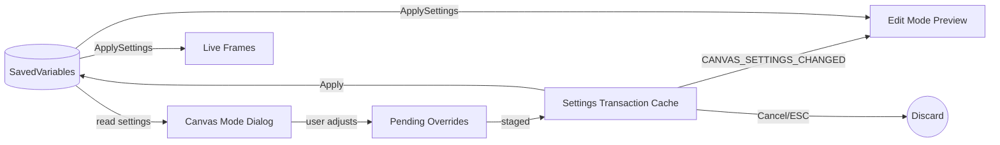

# canvas mode

orbit's intra-frame component editor. a separate dialog window for fine-tuning the position and styling of individual components within a single frame.

## purpose

when a user double-clicks a frame in edit mode, canvas mode opens a dialog window that renders all of that frame's internal components (text, icons, auras, cast bars) as draggable elements. the user can reposition components, adjust per-component overrides (font, size, color), dock/undock components, and zoom the viewport.

## data flow



canvas mode reads the same settings as live frames and edit mode. all changes are buffered as pending overrides and staged into the settings transaction cache. the transaction fires `CANVAS_SETTINGS_CHANGED` on each edit, allowing preview frames to live-update without touching saved variables. when the user hits "apply," the transaction commits to saved variables and triggers `ApplySettings` on both live frames and edit mode previews. cancel discards the transaction and restores preview frames to their pre-edit state.

## directory structure

```
CanvasMode/
  CanvasMode.xml          -- xml script bundle (load order)
  CanvasEdit.lua          -- canvas mode engine: enter/exit/toggle, selection tinting, background overlay
  ComponentRegistry.lua   -- component registration, drag mechanics, position callbacks, nudge
  ComponentHandle.lua     -- drag handle creation and pooling for components
  ComponentHelpers.lua    -- safe size/position utilities (WoW 12.0+ secret value handling)
  SmartGuides.lua         -- visual snap feedback lines (edge/center alignment)
  OverrideUtils.lua       -- per-component override read/write helpers
  Init.lua                -- canvas mode initialization and constants
  SettingsTransaction.lua -- transactional cache for edit sessions (Begin/Commit/Rollback)
  Dialog.lua              -- main dialog window: open/close, tab filtering, frame selection
  DialogActions.lua       -- dialog button handlers (apply, reset, cancel)
  Viewport.lua            -- viewport controls (zoom, pan, sync toggle, preview switching)
  Dock.lua                -- disabled component dock (drag-to-disable, click-to-restore)
  CanvasModeDrag.lua      -- intra-dialog component drag-and-drop
  ComponentSettings.lua   -- per-component settings panel (font, size, color, position overrides)
  Creators/               -- component creator registry (how to build draggable previews per type)
    Registry.lua
    AuraCreator.lua
    CastBarCreator.lua
    FontStringCreator.lua
    IconFrameCreator.lua
    PortraitCreator.lua
    TextureCreator.lua
```

## adding a new component type to canvas mode

see `Creators/Registry.lua` for the full pattern. in brief:

1. create a creator function in `Creators/`
2. register it via `OrbitEngine.CanvasMode.RegisterCreator(key, creatorFn)`
3. the creator receives the source component and returns a draggable preview

## rules

- canvas mode code may depend on edit mode infrastructure (`HandleCore`, `Pixel`), never on specific plugins
- all color constants for the dock and dialog must be at file top
- component settings modifications are applied via `OverrideUtils`
- the dialog must render correctly regardless of which plugin is active
- component drag functions run frequently — they must be performant (no allocations, no string concat)
- the apply action must update both live frames and edit mode previews in one pass via `ApplySettings`
