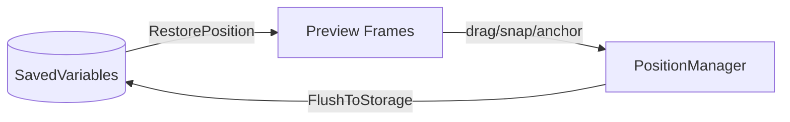

# edit mode

blizzard's edit mode integration. handles preview frames, selection, dragging, snapping, anchoring, and position persistence.

## purpose

provides the spatial management layer for all movable orbit frames within blizzard's native layout editor. when a user enters edit mode, this system creates preview frames that are clickable, draggable, and resizable. all positioning data flows through here before being persisted to saved variables.

## data flow



settings are read from saved variables to build edit mode previews. when the user drags or resizes a frame, changes are buffered in `PositionManager`. on edit mode exit, pending changes are flushed to saved variables via `plugin:SetSetting`.

## directory structure

```
EditMode/
  EditMode.lua          -- edit mode entry/exit hooks, combat safety
  PositionManager.lua   -- ephemeral position buffer (cancel support)
  MountedVisibility.lua -- hide frames while mounted
  NativeFrame.lua       -- native blizzard frame suppression/reparenting
  Frame/
    EditFrame.lua       -- edit mode frame facade (public api)
    EditFrame.xml       -- xml script bundle
    Factory.lua         -- frame factory
    Snap.lua            -- snap-to-grid and snap-to-frame
    Selection.lua       -- selection overlay rendering and state management
    Orientation.lua     -- left/right orientation detection
    Guard.lua           -- frame protection (combat lockdown safety)
    NudgeRepeat.lua     -- keyboard nudge repeat timer
    Position/
      AnchorGraph.lua   -- pure-data directed graph: virtual/disabled state, cycle detection, targeted chain reconciliation
      Anchor.lua        -- anchor chain resolution, parent/child relationships, border merge state (per-axis via ShouldMergeBorders), ResyncAll on border size changes, SetFrameVirtual for content-empty bypass
      Persistence.lua   -- position save/restore to saved variables
      PositionUtils.lua -- position math helpers (offset calculation, bounds)
    Selection/
      Drag.lua          -- drag-to-move interaction
      Nudge.lua         -- arrow-key pixel nudge
      Resize.lua        -- drag-to-resize handle (width/height settings)
      Tooltip.lua       -- selection tooltip display
  Handle/
    HandleCore.lua      -- shared handle frame infrastructure (used by both edit mode and canvas mode)
  Preview/
    PreviewFrame.lua    -- edit mode preview rendering
    PreviewHandle.lua   -- preview resize handles
    PreviewController.lua -- preview lifecycle
```

## canvas mode delegation

edit mode provides thin delegation methods to trigger canvas mode entry from selection double-click:

- `Frame:EnterCanvasMode(frame)` → `Engine.CanvasMode:Enter()`
- `Frame:ToggleCanvasMode(frame)` → `Engine.CanvasMode:Toggle()`

edit mode selection and drag files also check `Engine.CanvasMode:IsActive()` as a guard clause to adjust behavior when canvas mode is open. this is a legitimate cross-domain read.

## anchor graph

`AnchorGraph.lua` is a pure-data companion to `Anchor.lua`. it tracks two distinct skip states:

- **virtual** (`Anchor:SetFrameVirtual` → `AnchorGraph:SetVirtual`): content-empty frames (tracked bar with no spell, aura grid with no auras). the frame remains structurally registered in the graph but children are physically re-parented to the nearest non-skipped ancestor. use for content-scoped visibility.
- **disabled** (`Anchor:SetFrameDisabled` → `AnchorGraph:SetDisabled`): profile-level disabled frames (user toggled plugin off, spec-locked). the anchor graph entry survives so re-enable can resume anchoring without reloading from saved data.

both states use targeted `ReconcileChain(root)` instead of the legacy `RepairAllChains()`, reducing reconciliation from O(all_anchors) to O(chain).

when a parent is skipped, `ReconcileChain` promotes its children to the nearest non-skipped ancestor via `CreateAnchor` with `skipLogical=true`. the promoted child adopts the ancestor's edge via `ApplyAnchorPosition`'s `SetPoint`, visually stacking under the grandparent's content instead of following the parked parent off-screen. the logical anchor is preserved so the child returns home when the parent becomes visible again.

### rescue check (SetFrameVirtual/SetFrameDisabled park)

`SetFrameVirtual`/`SetFrameDisabled` normally call `ParkFrame` when toggling a frame skipped so it leaves the layout at its `defaultPosition`. but if the frame has already been **rescued** — meaning `RouteAroundSkipped` (synchronous, in `Persistence.RestorePosition`) or `PromoteGrandchild` (async, in `ReconcileChain`) has physically re-anchored it to a non-skipped grandparent while its logical parent stays skipped — re-parking would undo that work and the frame would teleport off-screen the frame after it was correctly placed. the `IsRescued(frame)` helper (in `Anchor.lua`) compares `logicalAnchors[frame].parent` against `anchors[frame].parent`: if they differ, and the logical parent is skipped while the physical parent is not, the park is suppressed. top-level virtualized frames (logical parent == physical parent, or no anchor at all) still get parked as before.

### logical vs physical graph

`Anchor.lua` maintains **two** parent/child tables:

- **physical graph** (`Anchor.anchors` / `Anchor.childrenOf`): where frames are actually attached right now. `ReconcileChain` rewrites this when virtual/disabled frames shift children to an ancestor.
- **logical graph** (`Anchor.logicalAnchors` / `Anchor.logicalChildrenOf`): the user-intended anchor — the parent the plugin or Edit Mode originally asked for. untouched by physical re-parenting.

the split solves "who owns this child" after a chain of virtualization toggles. when a virtualized parent stops being skipped, `AnchorGraph:RestoreLogicalChildren` walks `logicalChildrenOf[parent]` and reattaches any children whose home parent is this frame.

`CreateAnchor`/`BreakAnchor` accept a `skipLogical` flag (8th and 4th arg respectively). `ReconcileChain` passes `skipLogical=true` for physical repairs so the user-intended parent reference survives across virtual/disabled toggles. plugin code and Edit Mode interactions leave `skipLogical` unset so the logical graph tracks the user's intent.

`RestorePosition` (in `Persistence.lua`) mirrors the same split on the load/reload path. if the saved anchor target is currently skipped when `RestorePosition` runs — the common case during spec changes, where a child bar is restored while its main bar has already been marked virtual — `RouteAroundSkipped` records the logical intent on the saved target via `SetLogicalAnchor` and physically anchors to the nearest non-skipped ancestor via `CreateAnchor` with `skipLogical=true`. this is the synchronous fix for the load-order window: without it, `CreateAnchor` would attach the child to the parked target in the same frame that the scheduled `ReconcileChain` is queued, leaving the child visually trapped at the parked location for one frame (or indefinitely, when the virtualized target is itself the chain root and no explicit `fallback` is saved). if the virtualized target has no non-skipped ancestor at all, `RouteAroundSkipped` returns false and the caller falls through to `Position` / `defaultPosition`, with the logical intent still recorded for the eventual return home.

### batch reconciliation

`Graph:ScheduleReconcileChain(root)` / `Graph:ScheduleReconcileAll()` queue work for a single next-frame flush via `C_Timer.After(0)`. N schedule calls with the same root within one frame collapse to a single `ReconcileChain`. `ScheduleReconcileAll` supersedes any pending per-root work.

`SetFrameVirtual` / `SetFrameDisabled` use the scheduled path so bulk toggles during profile switches, spec swaps, or content-load fan-out collapse into one reconcile per affected chain. profile/spec reload paths (`ProfileManager`, `CooldownManager`, Edit Mode OnShow hook) use `ScheduleReconcileAll` so redundant full reconciles collapse.

if the flush fires during combat lockdown, it re-queues via `CombatManager:QueueUpdate` and replays when combat ends. pending data survives the bail.

## pending anchor queue (load-order seeding)

`Persistence.pendingByTarget` holds anchor intents whose target frame was not yet registered when `RestorePosition` ran. this handles the load-order race where a child plugin loads before its parent: rather than silently dropping the anchor and relying on a later re-apply, the intent is stashed keyed by the target's global name.

- `QueuePendingAnchor(child, targetName, edge, padding, align)` — called from the `anchor.target` branch of `RestorePosition` when `_G[anchor.target]` is nil.
- `DrainPendingFor(targetName)` — called from `AttachSettingsListener` after a frame is wired to its plugin. re-attempts any queued anchors that were waiting on this frame's name.
- `DrainAllPending()` — safety-net pass fired on `PLAYER_ENTERING_WORLD` so anything still queued gets one last chance before the user sees a half-broken layout.

entries whose target never materializes (profile references a deleted plugin) remain stashed and become no-ops on future drains.

## per-spec anchor routing

`Persistence:WriteAnchor` / `WritePosition` partition saved anchors per-spec when one of three conditions holds:

- the consumer plugin is built-in spec-scoped (`IsSpecScopedIndex(systemIndex)` true — CooldownManager)
- the **target** frame opts in via `frame.orbitAnchorTargetPerSpec = true` (Tracked containers / bars). this lets a non-spec-scoped consumer (e.g. PlayerPower) hold a separate saved anchor for each spec without the consumer plugin needing to know its target is per-spec.
- the consumer already has spec data for the current spec (stickiness — once per-spec, future Position writes stay per-spec for that spec only)

`ReadAnchor` / `ReadPosition` always check the current spec's slot first and fall back to the global plugin setting, so plugins that never wrote spec data are unaffected.

plugins whose `SetSetting`/`GetSetting` already partition per-spec at the record level (Tracked, where each record carries `spec`) set `plugin.settingsArePerSpec = true` to opt OUT of the routing — adding a second per-spec layer would silently desync from the per-record store and would not survive a profile export.

### spec-change re-restore

`Persistence._attachedFrames` is a weak-keyed registry populated by `AttachSettingsListener`. on `PLAYER_SPECIALIZATION_CHANGED`, `RestoreAffectedBySpecChange` walks the registry (deferred two frames so Tracked's `RefreshForCurrentSpec` and the subsequent `ReconcileChain` flush both settle first) and re-runs `RestorePosition` for any frame whose plugin has spec-scoped storage. this is what makes per-spec anchor routing visible to the live `AnchorGraph`: without it, the consumer's previous-spec anchor entry persists and width sync still works through `PromoteGrandchild`'s ancestor route, but the visual position lands on the ancestor instead of the new spec's intended target.

## rules

- edit mode code must work without any specific plugin loaded
- position data format: `{ point, relativeTo, relativePoint, x, y }`
- anchor chains resolve recursively. guard against cycles with depth limits.
- all pixel offsets must be snapped via `Pixel:Snap()`
- mounted visibility checks belong in `MountedVisibility.lua`, not in plugins
- `PositionManager` is ephemeral — it buffers changes until edit mode closes, enabling cancel support
- prefer `SetFrameVirtual` for content-empty frames, `SetFrameDisabled` for profile-level disable
- cycle detection must use `AnchorGraph:WouldCreateCycle()` (pure-data, no `GetNumPoints`)

