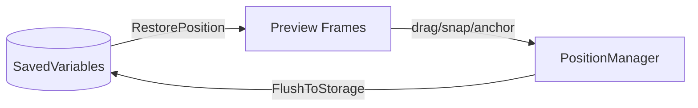

# edit mode

blizzard's edit mode integration. handles preview frames, selection, dragging, snapping, anchoring, and position persistence.

## purpose

provides the spatial management layer for all movable orbit frames within blizzard's native layout editor. when a user enters edit mode, this system creates preview frames that are clickable, draggable, and resizable. all positioning data flows through here before being persisted to saved variables.

## data flow



settings are read from saved variables to build edit mode previews. when the user drags or resizes a frame, changes are buffered in `PositionManager`. on edit mode exit, pending changes are flushed to saved variables via `plugin:SetSetting`.

## directory structure

```
EditMode/
  EditMode.lua          -- edit mode entry/exit hooks, combat safety
  PositionManager.lua   -- ephemeral position buffer (cancel support)
  MountedVisibility.lua -- hide frames while mounted
  NativeFrame.lua       -- park/hide blizzard frames without tainting them (12.0.5-safe)
  Frame/
    EditFrame.lua       -- edit mode frame facade (public api)
    EditFrame.xml       -- xml script bundle
    Factory.lua         -- frame factory
    Snap.lua            -- snap-to-grid and snap-to-frame
    Selection.lua       -- selection overlay rendering and state management
    Orientation.lua     -- left/right orientation detection
    Guard.lua           -- frame protection (combat lockdown safety)
    NudgeRepeat.lua     -- keyboard nudge repeat timer
    Position/
      Axis.lua          -- axis primitive (horizontal/vertical). chain + sync code is axis-parameterized; see Position/README.md
      AnchorGraph.lua   -- pure-data directed graph: virtual/disabled state, cycle detection, axis-parameterized chain nodes/root, targeted reconciliation
      Anchor.lua        -- anchor chain resolution, parent/child relationships, border merge state (per-axis via ShouldMergeBorders), ResyncAll on border size changes, SetFrameVirtual for content-empty bypass
      Persistence.lua   -- position save/restore to saved variables
      PositionUtils.lua -- position math helpers (offset calculation, bounds)
    Selection/
      Drag.lua          -- drag-to-move interaction
      Nudge.lua         -- arrow-key pixel nudge
      Resize.lua        -- drag-to-resize handle (width/height settings)
      Tooltip.lua       -- selection tooltip display
  Handle/
    HandleCore.lua      -- shared handle frame infrastructure (used by both edit mode and canvas mode)
  Preview/
    PreviewFrame.lua    -- edit mode preview rendering
    PreviewHandle.lua   -- preview resize handles
    PreviewController.lua -- preview lifecycle
```

## canvas mode delegation

edit mode provides thin delegation methods to trigger canvas mode entry from selection double-click:

- `Frame:EnterCanvasMode(frame)` → `Engine.CanvasMode:Enter()`
- `Frame:ToggleCanvasMode(frame)` → `Engine.CanvasMode:Toggle()`

edit mode selection and drag files also check `Engine.CanvasMode:IsActive()` as a guard clause to adjust behavior when canvas mode is open. this is a legitimate cross-domain read.

## anchor graph

`AnchorGraph.lua` is a pure-data companion to `Anchor.lua`. it tracks two distinct skip states:

- **virtual** (`Anchor:SetFrameVirtual` → `AnchorGraph:SetVirtual`): content-empty frames (tracked bar with no spell, aura grid with no auras). the frame remains structurally registered in the graph but children are physically re-parented to the nearest non-skipped ancestor. use for content-scoped visibility.
- **disabled** (`Anchor:SetFrameDisabled` → `AnchorGraph:SetDisabled`): profile-level disabled frames (user toggled plugin off, spec-locked). the anchor graph entry survives so re-enable can resume anchoring without reloading from saved data.

both states use targeted `ReconcileChain(root)` instead of the legacy `RepairAllChains()`, reducing reconciliation from O(all_anchors) to O(chain).

when a parent is skipped, `ReconcileChain` promotes its children to the nearest non-skipped ancestor via `CreateAnchor` with `skipLogical=true`. the promoted child adopts the ancestor's edge via `ApplyAnchorPosition`'s `SetPoint`, visually stacking under the grandparent's content instead of following the parked parent off-screen. the logical anchor is preserved so the child returns home when the parent becomes visible again.

### rescue check (SetFrameVirtual/SetFrameDisabled park)

`SetFrameVirtual`/`SetFrameDisabled` normally call `ParkFrame` when toggling a frame skipped so it leaves the layout at its `defaultPosition`. but if the frame has already been **rescued** — meaning `RouteAroundSkipped` (synchronous, in `Persistence.RestorePosition`) or `PromoteGrandchild` (async, in `ReconcileChain`) has physically re-anchored it to a non-skipped grandparent while its logical parent stays skipped — re-parking would undo that work and the frame would teleport off-screen the frame after it was correctly placed. the `IsRescued(frame)` helper (in `Anchor.lua`) compares `logicalAnchors[frame].parent` against `anchors[frame].parent`: if they differ, and the logical parent is skipped while the physical parent is not, the park is suppressed. top-level virtualized frames (logical parent == physical parent, or no anchor at all) still get parked as before.

### logical vs physical graph

`Anchor.lua` maintains **two** parent/child tables:

- **physical graph** (`Anchor.anchors` / `Anchor.childrenOf`): where frames are actually attached right now. `ReconcileChain` rewrites this when virtual/disabled frames shift children to an ancestor.
- **logical graph** (`Anchor.logicalAnchors` / `Anchor.logicalChildrenOf`): the user-intended anchor — the parent the plugin or Edit Mode originally asked for. untouched by physical re-parenting.

the split solves "who owns this child" after a chain of virtualization toggles. when a virtualized parent stops being skipped, `AnchorGraph:RestoreLogicalChildren` walks `logicalChildrenOf[parent]` and reattaches any children whose home parent is this frame.

`CreateAnchor`/`BreakAnchor` accept a `skipLogical` flag (8th and 4th arg respectively). `ReconcileChain` passes `skipLogical=true` for physical repairs so the user-intended parent reference survives across virtual/disabled toggles. plugin code and Edit Mode interactions leave `skipLogical` unset so the logical graph tracks the user's intent.

`RestorePosition` (in `Persistence.lua`) mirrors the same split on the load/reload path via a unified `ResolveAnchor(anchor)` walk. given a saved anchor, the candidate chain is `[target, ...live ancestors above target, ...saved ancestry]` and the first usable candidate wins. a candidate is "usable" when it exists in `_G`, is not skipped (virtual/disabled), and `CreateAnchor` accepts it (no cycle, edge available).

logical intent is recorded once, before the walk:
- target exists in `_G` → `SetLogicalAnchor(frame, target)`. `RestoreLogicalChildren` later pulls the child home when target becomes usable.
- target missing from `_G` (cross-plugin load-order race; or spec-locked plugin whose `OnLoad` was skipped because `IsPluginEnabled` returns false for spec-locked plugins) → `QueuePendingAnchor`. `DrainPendingFor` sets the logical anchor when the real target frame appears.

every `CreateAnchor` in the walk uses `skipLogical=true` because logical intent is already recorded — the logical anchor always points at the user's actual target, not whichever ancestor the walk landed on. this is what makes `RestoreLogicalChildren` correct: when the target later un-skips, the child snaps home from any ancestor it was temporarily sitting on.

the candidate chain in detail:

1. **target itself** — if it exists in `_G` and isn't skipped.
2. **live graph walk above target** — `GetAnchorParent(target)` repeatedly. most accurate when the graph is populated (spec swap mid-session, where intermediate parents already have their anchors). yields nothing on fresh login when the skipped target's own anchor hasn't been restored yet.
3. **saved ancestry** — `anchor.ancestry` is an ordered nearest-first list captured at drag-stop by `BuildAncestry` (walks `GetAnchorParent` up the chain, capped at `MAX_ANCESTRY_DEPTH = 10` for cycle/storage safety). reads `_G` directly, so it works without a populated graph. handles multi-level breaks: chain `A → B → C → D → E` with `B` and `C` both disabled lands `E` on `D` (or `A` if `D` is also missing) instead of falling to `defaultPosition`.

`anchor.fallback` is the legacy single-name root captured by older save data; treated as a 1-element ancestry when `anchor.ancestry` is absent. drag-stop writes both for forward/backward compat.

if the entire chain is exhausted, `ResolveAnchor` preserves any anchor that `DrainPendingFor` may have wired during the cross-plugin load-order race (`existing.parent == targetFrame`). otherwise it returns false and `RestorePosition` falls through to `Position` / `defaultPosition`, with the logical intent still recorded for the eventual return home.

`ReconcileChain`'s skipped-root branch uses the same ancestry-then-fallback resolution to promote grandchildren past a skipped root.

### batch reconciliation

`Graph:ScheduleReconcileChain(root)` / `Graph:ScheduleReconcileAll()` queue work for a single next-frame flush via `C_Timer.After(0)`. N schedule calls with the same root within one frame collapse to a single `ReconcileChain`. `ScheduleReconcileAll` supersedes any pending per-root work.

`SetFrameVirtual` / `SetFrameDisabled` use the scheduled path so bulk toggles during profile switches, spec swaps, or content-load fan-out collapse into one reconcile per affected chain. profile/spec reload paths (`ProfileManager`, `CooldownManager`, Edit Mode OnShow hook) use `ScheduleReconcileAll` so redundant full reconciles collapse.

if the flush fires during combat lockdown, it re-queues via `CombatManager:QueueUpdate` and replays when combat ends. pending data survives the bail.

## pending anchor queue (load-order seeding)

`Persistence.pendingByTarget` holds anchor intents whose target frame was not yet registered when `RestorePosition` ran. this handles two scenarios:

- **load-order race**: child plugin loads before its parent.
- **spec-locked target**: `Orbit:IsPluginEnabled` returns false for spec-locked plugins, so their `OnLoad` is skipped entirely and their frame is never created. on a Holy Priest login a chain like `EC → PR → PP` has no `OrbitPlayerResources` frame in `_G` at all — not just skipped, missing.

rather than silently dropping the anchor and relying on a later re-apply, the intent is stashed keyed by the target's global name. crucially, the saved `anchor.ancestry` / legacy `anchor.fallback` are also consulted in the missing-target branch so the child can physically anchor to a live ancestor (with `skipLogical=true`) while waiting for the real target. `DrainPendingFor` later replaces the temporary anchor and sets the logical anchor properly.

- `QueuePendingAnchor(child, targetName, edge, padding, align)` — called from the `anchor.target` branch of `RestorePosition` when `_G[anchor.target]` is nil. dedups in-place so repeated `RestorePosition` calls (profile switch, spec-locked target staying off) don't accumulate duplicate entries.
- `DrainPendingFor(targetName)` — called from `AttachSettingsListener` after a frame is wired to its plugin. re-attempts any queued anchors that were waiting on this frame's name.
- `DrainAllPending()` — safety-net pass fired on `PLAYER_ENTERING_WORLD` so anything still queued gets one last chance before the user sees a half-broken layout.

entries whose target never materializes (profile references a deleted plugin, or spec-locked target the user never visits) remain stashed and become no-ops on future drains. memory cost is bounded by the dedup: one entry per (target, child) pair.

## per-spec anchor routing

`Persistence:WriteAnchor` / `WritePosition` partition saved anchors per-spec when one of three conditions holds:

- the consumer plugin is built-in spec-scoped (`IsSpecScopedIndex(systemIndex)` true — CooldownManager)
- the **target** frame opts in via `frame.orbitAnchorTargetPerSpec = true` (Tracked containers / bars). this lets a non-spec-scoped consumer (e.g. PlayerPower) hold a separate saved anchor for each spec without the consumer plugin needing to know its target is per-spec.
- the consumer already has spec data for the current spec (stickiness — once per-spec, future Position writes stay per-spec for that spec only)

`ReadAnchor` / `ReadPosition` always check the current spec's slot first and fall back to the global plugin setting, so plugins that never wrote spec data are unaffected.

plugins whose `SetSetting`/`GetSetting` already partition per-spec at the record level (Tracked, where each record carries `spec`) set `plugin.settingsArePerSpec = true` to opt OUT of the routing — adding a second per-spec layer would silently desync from the per-record store and would not survive a profile export.

### spec-change re-restore

`Persistence._attachedFrames` is a weak-keyed registry populated by `AttachSettingsListener`. on `PLAYER_SPECIALIZATION_CHANGED`, `RestoreAffectedBySpecChange` walks the registry (deferred two frames so Tracked's `RefreshForCurrentSpec` and the subsequent `ReconcileChain` flush both settle first) and re-runs `RestorePosition` — but **only** for frames whose plugin is built-in spec-scoped via `IsSpecScopedIndex(systemIndex)`. this is what makes per-spec anchor routing visible to the live `AnchorGraph`: without it, the consumer's previous-spec anchor entry persists and cross-axis sync still works through `PromoteGrandchild`'s ancestor route, but the visual position lands on the ancestor instead of the new spec's intended target.

the `IsSpecScopedIndex` gate is intentional opt-in, not auto-opt-in by mixin presence. `PluginMixin` hands `GetSpecData`/`SetSpecData` to every plugin so per-character per-spec storage is available to anyone who wants it, but walking **every** attached frame on every spec change (which Blizzard fires on role assignment during group joins, instance transitions, and talent loadouts) causes a visible stall once enough plugins are registered. plugins that own their own positioning logic — GroupFrames stores positions per-group-size-tier, for example — simply don't implement `IsSpecScopedIndex` and are skipped.

### profile-change re-restore

`RestoreAffectedByProfileChange` mirrors `RestoreAffectedBySpecChange` but fires on `ORBIT_PROFILE_CHANGED` and walks **every** attached frame, with no `IsSpecScopedIndex` filter. profile switch swaps `Orbit.runtime.Layouts` and `Orbit.db.GlobalSettings` to the new profile's snapshot — but the live `AnchorGraph` entries still hold the previous profile's `(target, edge, padding)`, and any consumer reading via `ReadAnchor` after the swap would normally only refresh if its plugin called `RestorePosition` from inside `ApplySettings`. some do (PlayerPower), most don't.

the walk is unfiltered because `SpecData` is account-scoped — a consumer whose saved anchor lives in `SpecData[char][spec]` (e.g. PlayerPower anchored to a Tracked container with `orbitAnchorTargetPerSpec`) carries the same anchor across profile switches even when the target is hidden/disabled in the new profile. `RestorePosition` re-evaluates and `RouteAroundSkipped` records logical intent + physically attaches to the nearest non-skipped ancestor, so the chain visually settles on something live instead of hanging on a parked frame.

the two-frame defer matches the spec path — `RefreshForCurrentSpec` (Tracked) fires on the same event and the subsequent `ReconcileChain` flush needs to settle before the re-attach pass walks consumer frames.


## rules

- edit mode code must work without any specific plugin loaded
- position data format: `{ point, relativeTo, relativePoint, x, y }`
- anchor chains resolve recursively. guard against cycles with depth limits.
- all pixel offsets must be snapped via `Pixel:Snap()`
- mounted visibility checks belong in `MountedVisibility.lua`, not in plugins
- `PositionManager` is ephemeral — it buffers changes until edit mode closes, enabling cancel support
- prefer `SetFrameVirtual` for content-empty frames, `SetFrameDisabled` for profile-level disable
- cycle detection must use `AnchorGraph:WouldCreateCycle()` (pure-data, no `GetNumPoints`)
- listen for edit mode lifecycle via `EventRegistry:RegisterCallback("EditMode.Enter"/"EditMode.Exit", ...)`. Never `EditModeManagerFrame:HookScript("OnShow"/"OnHide", ...)` — the hookscript callback rides the dangerous secure execution chain that runs `ResetPartyFrames` on exit; `EventRegistry` fires after the chain has settled and is the official Blizzard signal.
- never write to `EditModeManagerFrame` from Orbit code (no `:SetPoint`, `:ClearAllPoints`, `:SetAlpha`, `:EnableMouse`, `:Hide`, `:Show` on it). Use `securecall("HideUIPanel"/"ShowUIPanel", EditModeManagerFrame)` if you must drive it.

## native blizzard frame suppression (`NativeFrame.lua`)

`NativeFrame:Park(frame)` is the canonical way to suppress a Blizzard-owned frame so Orbit's replacement can take its slot. It is taint-safe under WoW 12.0.5+ strict execution rules. The recipe is the addon-community consensus pattern verified across ElvUI, Cell, Bartender4, EllesmereUI, and DandersFrames at HEAD as of 2026-05-04:

1. `frame:UnregisterAllEvents()` — silences Blizzard's update path so `CompactUnitFrame_UpdateAll` etc. never run.
2. `(frame.HideBase or frame.Hide)(frame)` — uses the pre-EditMode-override `HideBase` reference saved by `EditModeSystemMixin:OnSystemLoad`. Calling `:HideBase()` skips Blizzard's tainted `HideOverride`. `pcall(frame.Hide, frame)` is the fallback for non-EditMode-registered frames.
3. `frame:SetParent(self.hiddenParent)` — moves the frame off-screen via a single `OrbitHiddenParent` child of UIParent.
4. Self-installed `hooksecurefunc` re-claim hooks on `Show`, `SetShown`, and `SetParent` that fire `SafeHide` if Blizzard later tries to show or reparent. They check `parked[f]` so `Unpark` makes them no-ops.

What `Park` deliberately does NOT do (these were taint vectors in the pre-Park `Disable`/`Protect`/`Enable` API and are now removed):

- No `:ClearAllPoints` / `:SetPoint` writes — anchor mutations on a Blizzard secure frame taint its descendants. Verified bug: writes to `CompactPartyFrame` tainted `frame.healthBar:GetStatusBarColor()` at `CompactUnitFrame.lua:692` after EditMode exit ran `ResetPartyFrames → CompactPartyFrame:RefreshMembers → CompactUnitFrame_UpdateHealthColor`.
- No `:SetAlpha` / `:EnableMouse` writes — same propagation surface as anchor writes.
- No `hooksecurefunc(frame, "SetPoint", ...)` re-fire loop — the loop re-tainted on every Blizzard reposition. Removed entirely.
- No `RegisterStateDriver(<Blizzard frame>, "visibility", "hide")` — EllesmereUI's HEAD source (Apr 2026) explicitly forbids this with the comment "No RegisterAttributeDriver calls on Blizzard-owned frames — those risk tainting protected state." `Park` covers the equivalent need without writing to the frame's secure attribute namespace.

Use `Park(frame)` for: PlayerFrame, TargetFrame, FocusFrame, BuffFrame, DebuffFrame, BossFrames, PartyMemberFrames, PartyFrame, CompactPartyFrame, CompactRaidFrameContainer, CompactRaidFrameManager, PlayerCastingBarFrame, action bar frames. Combined with `UIParent:UnregisterEvent('GROUP_ROSTER_UPDATE')` and `CompactRaidFrameManager_SetSetting('IsShown', '0')` at the call site (see `Plugins/GroupFrames/GroupFrame.lua:HideNativeGroupFrames`), it kills the entire Blizzard group-frame update path.

`Park` requires combat-out execution — call from plugin OnLoad, not in combat. Re-application is a no-op (idempotent via the `_orbitParkHooked` flag plus the `parked` set).

`Unpark` clears the `parked` flag so the re-claim hooks fall through. Use for live toggles like `HideBlizzardRaidPanel`. The hooks remain installed but become no-ops.

Remaining `NativeFrame` ops (less common): `:Hide(frame, options)` does a full reparent + event/script teardown with `Restore` support — used for MinimapCluster (events left intact via `unregisterEvents = false`). `:SecureHide(frame)` uses `RegisterStateDriver(frame, "visibility", "hide")` — kept for action bars / status tracking bars where the driver path is the documented contract. `:Modify(frame, options)` / `:RestoreModified` apply non-tainting alpha/scale/strata changes for frames Orbit already owns.

`:KeepAliveHidden(frame)` is a softer variant for the case where Orbit reuses Blizzard's own children — e.g. PlayerBuffs/PlayerDebuffs hooks `BuffFrame:Update` and reparents the live aura buttons (`BuffFrame.auraFrames`) into Orbit's grid. The native frame must keep receiving events so its update loop keeps populating `auraFrames`. `KeepAliveHidden` does only `SafeHide(frame)` plus `hooksecurefunc(Show/SetShown)` re-hide hooks — no `UnregisterAllEvents`, no `SetParent`. Combat-guarded. Use when your plugin scrapes button state from a Blizzard manager frame and the manager must keep updating.

## blizzard grid + snap preview tap-in

`EditModeManagerFrame.Grid` (the blue grid) and `MagnetismPreviewLinesContainer` (the red snap preview lines) are Blizzard-owned frames that render automatically while Blizzard's edit mode dialog is shown. Orbit edit mode rides that dialog's lifecycle (see `EditMode.lua`) so the grid visual is free — the user toggles it via Blizzard's "Show Grid" / "Enable Snap" checkboxes and the spacing slider, all persisted in `Enum.EditModeAccountSetting`.

To make the red preview lines appear for a dragged Orbit frame (against UIParent edges and registered grid lines), `Frame/Selection/Drag.lua` does two things:

1. Installs three `EditModeSystemMixin` methods on the parent frame the first time it is dragged: `GetScaledSelectionSides`, `GetScaledSelectionCenter`, and `GetFrameMagneticEligibility`. The first two convert the frame's rect to UIParent-local coordinates (the space Blizzard's magnetism math operates in) using `effectiveScale / UIParent:GetEffectiveScale()` so frames parented below UIParent compute correctly. The eligibility shim always returns `nil` — Orbit frames decline frame-to-frame magnetism with Blizzard systems because Orbit's own `FrameSnap` handles that with richer edge/chain semantics.
2. Calls `EditModeManagerFrame:SetSnapPreviewFrame(parent)` on drag start and `ClearSnapPreviewFrame` on drag stop. Shift-drag (precision mode) and `orbitNoSnap` both suppress the preview; the `AnchoringEnabled` global also gates it.

Because the preview lines signal where the frame WILL snap on drop, `Frame/Snap.lua:DetectSnap` also appends UIParent-edge and grid-line offsets as synthetic alignment candidates (read from `EditModeMagnetismManager.magneticGridLines`, which the Blizzard grid populates in `EditModeGridLineMixin:SetupLine`). These use Blizzard's own `magnetismRange` (8 screen pixels, matches the red-line tolerance). **Frame-to-frame anchor candidates take priority over the grid/UIParent fallback**: when an Orbit anchor target is within `ANCHOR_THRESHOLD` (10 screen pixels) on an axis, that axis is locked to the anchor and the grid/UIParent candidate is skipped on that axis. Where no anchor candidate exists, the grid/UIParent candidate (if within `magnetismRange`) wins over a tighter alignment match. On drop, the final L/B is pushed through `Pixel:Snap` so the frame edge lands exactly on the guideline's pixel. This keeps the visual promise (red line) and the drop behavior (actual snap) in lockstep when no anchor target is in range.

The tap-in is one-way: Orbit never calls `EditModeMagnetismManager:RegisterFrame` on its own frames, so Blizzard systems cannot snap to Orbit frames. None of `SetSnapPreviewFrame`, `ClearSnapPreviewFrame`, or reading `magneticGridLines` crosses any secure boundary, so the tap-in is taint-free.

