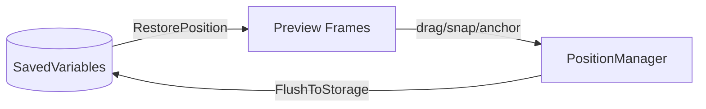

# edit mode

blizzard's edit mode integration. handles preview frames, selection, dragging, snapping, anchoring, and position persistence.

## purpose

provides the spatial management layer for all movable orbit frames within blizzard's native layout editor. when a user enters edit mode, this system creates preview frames that are clickable, draggable, and resizable. all positioning data flows through here before being persisted to saved variables.

## data flow



settings are read from saved variables to build edit mode previews. when the user drags or resizes a frame, changes are buffered in `PositionManager`. on edit mode exit, pending changes are flushed to saved variables via `plugin:SetSetting`.

## directory structure

```
EditMode/
  EditMode.lua          -- edit mode entry/exit hooks, combat safety
  PositionManager.lua   -- ephemeral position buffer (cancel support)
  MountedVisibility.lua -- hide frames while mounted
  NativeFrame.lua       -- native blizzard frame suppression/reparenting
  Frame/
    EditFrame.lua       -- edit mode frame facade (public api)
    EditFrame.xml       -- xml script bundle
    Factory.lua         -- frame factory
    Snap.lua            -- snap-to-grid and snap-to-frame
    Selection.lua       -- selection overlay rendering and state management
    Orientation.lua     -- left/right orientation detection
    Guard.lua           -- frame protection (combat lockdown safety)
    NudgeRepeat.lua     -- keyboard nudge repeat timer
    Position/
      AnchorGraph.lua   -- pure-data directed graph: virtual/disabled state, cycle detection, targeted chain reconciliation
      Anchor.lua        -- anchor chain resolution, parent/child relationships, border merge state (per-axis via ShouldMergeBorders), ResyncAll on border size changes, SetFrameVirtual for content-empty bypass
      Persistence.lua   -- position save/restore to saved variables
      PositionUtils.lua -- position math helpers (offset calculation, bounds)
    Selection/
      Drag.lua          -- drag-to-move interaction
      Nudge.lua         -- arrow-key pixel nudge
      Resize.lua        -- drag-to-resize handle (width/height settings)
      Tooltip.lua       -- selection tooltip display
  Handle/
    HandleCore.lua      -- shared handle frame infrastructure (used by both edit mode and canvas mode)
  Preview/
    PreviewFrame.lua    -- edit mode preview rendering
    PreviewHandle.lua   -- preview resize handles
    PreviewController.lua -- preview lifecycle
```

## canvas mode delegation

edit mode provides thin delegation methods to trigger canvas mode entry from selection double-click:

- `Frame:EnterCanvasMode(frame)` → `Engine.CanvasMode:Enter()`
- `Frame:ToggleCanvasMode(frame)` → `Engine.CanvasMode:Toggle()`

edit mode selection and drag files also check `Engine.CanvasMode:IsActive()` as a guard clause to adjust behavior when canvas mode is open. this is a legitimate cross-domain read.

## anchor graph

`AnchorGraph.lua` is a pure-data companion to `Anchor.lua`. it tracks two distinct skip states:

- **virtual** (`Anchor:SetFrameVirtual` → `AnchorGraph:SetVirtual`): content-empty frames (tracked bar with no spell, aura grid with no auras). the frame remains structurally registered in the graph but children are physically re-parented to the nearest non-skipped ancestor. use for content-scoped visibility.
- **disabled** (`Anchor:SetFrameDisabled` → `AnchorGraph:SetDisabled`): profile-level disabled frames (user toggled plugin off, spec-locked). the anchor is severed and must be reconstructed from saved data when re-enabled.

both states use targeted `ReconcileChain(root)` instead of the legacy `RepairAllChains()`, reducing reconciliation from O(all_anchors) to O(chain).

## rules

- edit mode code must work without any specific plugin loaded
- position data format: `{ point, relativeTo, relativePoint, x, y }`
- anchor chains resolve recursively. guard against cycles with depth limits.
- all pixel offsets must be snapped via `Pixel:Snap()`
- mounted visibility checks belong in `MountedVisibility.lua`, not in plugins
- `PositionManager` is ephemeral — it buffers changes until edit mode closes, enabling cancel support
- prefer `SetFrameVirtual` for content-empty frames, `SetFrameDisabled` for profile-level disable
- cycle detection must use `AnchorGraph:WouldCreateCycle()` (pure-data, no `GetNumPoints`)

