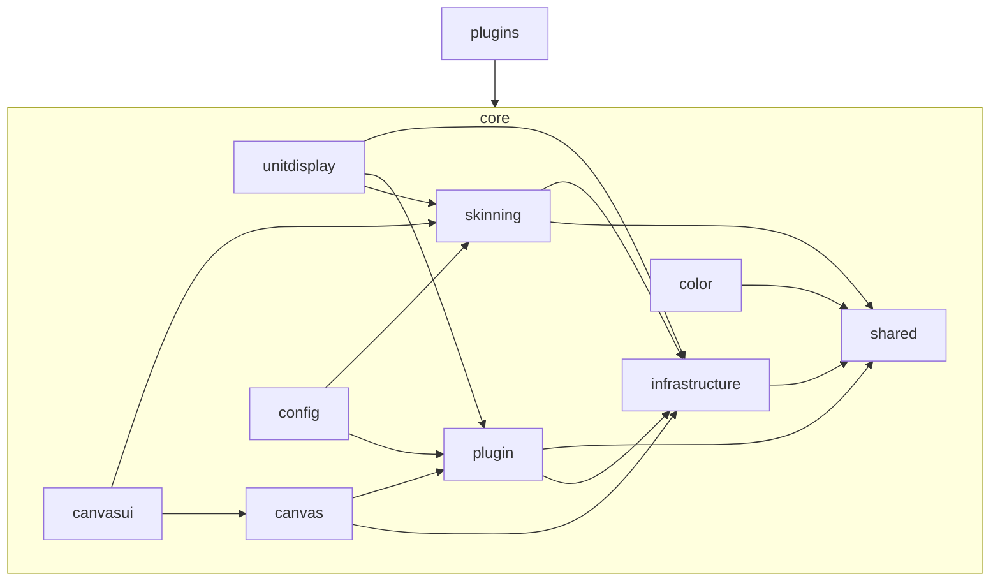

# orbit core

this is the root of the orbit engine. everything that plugins depend on lives here.

## purpose

core provides the shared infrastructure, rendering engine, configuration system, canvas mode, skinning pipeline, and unit display mixins that all plugins consume. it has zero knowledge of any specific plugin.

## directory structure

```
Core/
  Init.lua          -- addon bootstrap, plugin registration, saved variables
  API.lua           -- public api surface (slash commands, programmatic api)
  Infrastructure/   -- low-level systems (events, pixel math, combat, animation)
  Plugin/           -- plugin lifecycle (registration, profiles, mixins)
  Shared/           -- constants, media registrations
  Color/            -- color resolution (class colors, reaction colors, curve engine)
  Skinning/         -- visual rendering (borders, textures, icons, cast bars)
  UnitDisplay/      -- unit frame mixins (health bars, auras, cast bars, status icons)
  Canvas/           -- canvas mode engine (dragging, anchoring, positioning)
  CanvasUI/         -- canvas mode ui (dialog, dock, viewport, component settings)
  Config/           -- settings ui (schema builder, renderer, widgets, options panel)
  Libs/             -- third-party libraries
  assets/           -- textures and media files
```

## dependency direction



dependencies flow **inward**. plugins depend on core. core never depends on plugins.

## rules

- no file in core may reference a plugin by name
- new engine-level systems go in infrastructure
- new unit frame shared behavior goes in unitdisplay
- new visual rendering logic goes in skinning
- new configuration widgets go in config/widgets
- constants belong in shared/constants.lua, never inline
- all files must follow the constants-at-top, no-magic-numbers standard
