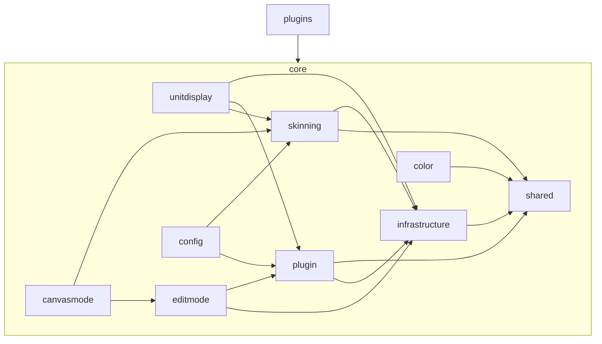

# orbit core

this is the root of the orbit engine. everything that plugins depend on lives here.

## purpose

core provides the shared infrastructure, rendering engine, configuration system, canvas mode, skinning pipeline, and unit display mixins that all plugins consume. it has zero knowledge of any specific plugin.

## directory structure

```
Core/
  Init.lua          -- addon bootstrap, plugin registration, saved variables
  API.lua           -- public api surface (slash commands, programmatic api)
  Infrastructure/   -- low-level systems (events, pixel math, combat, animation)
  Plugin/           -- plugin lifecycle (registration, profiles, mixins)
  Shared/           -- constants, media registrations, glow controller
  Color/            -- color resolution (class colors, reaction colors, curve engine)
  Skinning/         -- visual rendering (borders, textures, icons, cast bars, action buttons)
  UnitDisplay/      -- unit frame mixins (health bars, auras, cast bars, status icons)
  EditMode/         -- edit mode engine (dragging, anchoring, positioning, preview frames)
  CanvasMode/       -- canvas mode dialog (intra-frame component editor, overrides, creators)
  Config/           -- settings ui (schema builder, renderer, widgets, options panel)
  Onboarding/       -- first-run guided tour (edit mode playground, canvas / drawer hints)
  Libs/             -- third-party libraries
  assets/           -- textures and media files
```

## dependency direction


```mermaid
graph TD
    subgraph core
        infrastructure --> shared
        plugin --> infrastructure
        plugin --> shared
        color --> shared
        skinning --> shared
        skinning --> infrastructure
        unitdisplay --> skinning
        unitdisplay --> plugin
        unitdisplay --> infrastructure
        editmode --> infrastructure
        editmode --> plugin
        canvasmode --> editmode
        canvasmode --> skinning
        config --> plugin
        config --> skinning
    end
    plugins --> core
```

dependencies flow **inward**. plugins depend on core. core never depends on plugins.

## data architecture

orbit uses strict boundaries for how data is saved and persisted across `/reload` and sessions:

- `Orbit.db.AccountSettings` — **true account-wide application data**. data that belongs to the human player at the keyboard regardless of character or spec (color picker history, tutorial flags, minimap icon visibility). entirely immune to `ProfileManager`.
- `Orbit.db.GlobalSettings` — **the aesthetic theme for the current profile**. ui styling that applies globally across *all* plugins for a specific layout configuration (universal border sizes, main fonts, status bar textures).
- `Orbit.db.Profiles[name]` — per-profile layout data (plugin settings, frame positions, anchors).
- `Orbit.db.SpecData[charKey][specID][systemIndex][key]` — per-character per-spec storage layered through `PluginMixin:GetSpecData` / `SetSpecData`.

> do not put non-theme application data into `GlobalSettings`. `ProfileManager` clones `profile.GlobalSettings` into the live `Orbit.db.GlobalSettings` memory block on every profile activation (which fires on login and `/reload`). un-flushed application data stored there is permanently erased.

## rules

- no file in core may reference a plugin by name
- new engine-level systems go in infrastructure
- new unit frame shared behavior goes in unitdisplay
- new visual rendering logic goes in skinning
- new configuration widgets go in config/widgets
- constants belong in shared/constants.lua, never inline
- all files must follow the constants-at-top, no-magic-numbers standard
