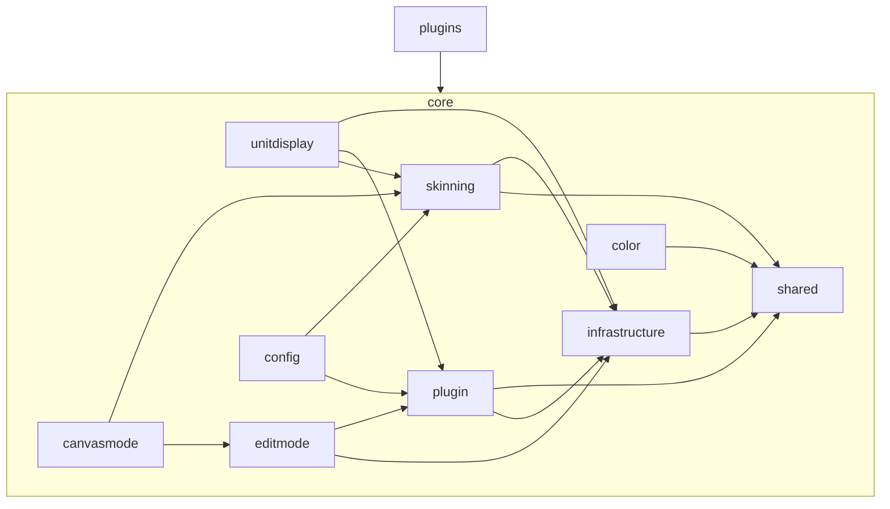

# orbit core

this is the root of the orbit engine. everything that plugins depend on lives here.

## purpose

core provides the shared infrastructure, rendering engine, configuration system, canvas mode, skinning pipeline, and unit display mixins that all plugins consume. it has zero knowledge of any specific plugin.

## directory structure

```
Core/
  Init.lua          -- addon bootstrap, plugin registration, saved variables
  API.lua           -- public api surface (slash commands, programmatic api)
  Infrastructure/   -- low-level systems (events, pixel math, combat, animation)
  Plugin/           -- plugin lifecycle (registration, profiles, mixins)
  Shared/           -- constants, media registrations
  Color/            -- color resolution (class colors, reaction colors, curve engine)
  Skinning/         -- visual rendering (borders, textures, icons, cast bars)
  UnitDisplay/      -- unit frame mixins (health bars, auras, cast bars, status icons)
  EditMode/         -- edit mode engine (dragging, anchoring, positioning, preview frames)
  CanvasMode/       -- canvas mode dialog (intra-frame component editor, overrides, creators)
  Config/           -- settings ui (schema builder, renderer, widgets, options panel)
  Libs/             -- third-party libraries
  assets/           -- textures and media files
```

## dependency direction


```mermaid
graph TD
    subgraph core
        infrastructure --> shared
        plugin --> infrastructure
        plugin --> shared
        color --> shared
        skinning --> shared
        skinning --> infrastructure
        unitdisplay --> skinning
        unitdisplay --> plugin
        unitdisplay --> infrastructure
        editmode --> infrastructure
        editmode --> plugin
        canvasmode --> editmode
        canvasmode --> skinning
        config --> plugin
        config --> skinning
    end
    plugins --> core
```

dependencies flow **inward**. plugins depend on core. core never depends on plugins.

## data architecture

orbit uses strict boundaries for how data is saved and persisted across `/reload` and sessions:

- `Orbit.db.AccountSettings`: **True Account-Wide Application Data**. Used for data that belongs to the human player at the keyboard, regardless of what character or spec they are playing (e.g., Color Picker History, Tutorial Flags, Minimap Icon visibility). This table is entirely immune to the ProfileManager.
- `Orbit.db.GlobalSettings`: **The Aesthetic Theme for the Current Profile**. Used for UI styling that applies globally across *all* plugins for a specific layout configuration (e.g., universal border sizes, main fonts, status bar textures). 

**Warning**: Do not put non-theme application data into `GlobalSettings`. The `ProfileManager` actively clones `profile.GlobalSettings` into the live `Orbit.db.GlobalSettings` memory block whenever a profile activates (which triggers dynamically on every login and `/reload`). This will permanently erase any un-flushed application data stored there!

## rules

- no file in core may reference a plugin by name
- new engine-level systems go in infrastructure
- new unit frame shared behavior goes in unitdisplay
- new visual rendering logic goes in skinning
- new configuration widgets go in config/widgets
- constants belong in shared/constants.lua, never inline
- all files must follow the constants-at-top, no-magic-numbers standard
