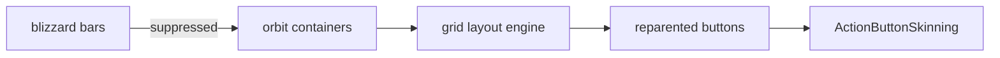

# action bars

replaces blizzard's action bars with a configurable grid-based system.

## purpose

suppresses native blizzard action bars and reparents their buttons into orbit containers. supports up to 8 standard bars (wow 12.0 hard limit of 180 slots) plus a pet bar.

## files

| file | responsibility |
|---|---|
| ActionBars.lua | main plugin. bar creation, button reparenting, visibility drivers, ooc fade, grid layout. |
| ActionBarsContainer.lua | individual bar container frame. manages button grid within a single bar. |
| ActionBarsPreview.lua | canvas mode preview generation. |
| ActionBarsText.lua | text overlay settings (keybind, macro name, count) and canvas mode text styling. |

## how it works

1. native bars are hidden and their buttons reparented into orbit container frames
2. each container uses a grid layout engine for button positioning
3. `ActionButtonSkinning` (in core/skinning) handles visual overrides
4. visibility is driven by combat state and ooc fade settings

## adding a new bar feature

1. if it affects all bars, add it to `ActionBars.lua` in the `ApplySettings` section
2. if it affects individual bar containers, add it to `ActionBarsContainer.lua`
3. text/font features go in `ActionBarsText.lua`
4. always add schema entries in `AddSettings` for user configuration

## rules

- pet bar has special handling (index-based, no ooc fade)
- button reparenting must preserve secure frame references for combat
- all grid math must use pixel-snapped values
- bar visibility uses macro conditional drivers (`RegisterStateDriver`)
