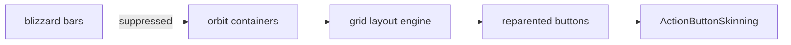

# action bars

replaces blizzard's action bars with a configurable grid-based system.

## purpose

suppresses native blizzard action bars and reparents their buttons into orbit containers. supports up to 8 standard bars (wow 12.0 hard limit of 180 slots) plus a pet bar.

## files

| file | responsibility |
|---|---|
| ActionBars.lua | main plugin. bar creation, button reparenting, visibility drivers, ooc fade, grid layout, spell state coloring (range/usable/mana), proc glow hooks (via GlowController, triggered by ActionButtonSpellAlertManager). |
| ActionBarsContainer.lua | individual bar container frame. manages button grid within a single bar. |
| ActionBarsPreview.lua | canvas mode preview generation. |
| ActionBarsText.lua | text overlay settings (keybind, macro name, count) and canvas mode text styling. |

## how it works

```mermaid
graph LR
    blizzard[blizzard bars] -->|suppressed| orbit[orbit containers]
    orbit --> grid[grid layout engine]
    grid --> buttons[reparented buttons]
    buttons --> skin[ActionButtonSkinning]
```

1. native bars are hidden and their buttons reparented into orbit container frames
2. each container uses a grid layout engine for button positioning
3. `ActionButtonSkinning` (in core/skinning) handles visual overrides
4. skin settings include `iconBorder = true` to opt into `GlobalSettings.IconBorderStyle` (NineSlice/LSM icon borders). when `IconPadding = 0`, a single group border wraps the container instead of per-icon borders. containers set `mergeBorders = true` in `anchorOptions`, enabling cross-bar group borders when anchored at padding=0
5. visibility is driven by combat state and ooc fade settings
6. spell state events (`ACTIONBAR_UPDATE_USABLE`, `SPELL_UPDATE_USABLE`, `ACTION_RANGE_CHECK_UPDATE`, `PLAYER_TARGET_CHANGED`) drive `RefreshIconColor` to tint icons for out-of-range, out-of-mana, and not-usable states. **No `hooksecurefunc` on Blizzard's `ActionButton.Update` / `.UpdateUsable`** — those hooks taint the secure call frame under 12.0.5+ secret-value strictness, which propagates into `ActionButton_ApplyCooldown` (rejecting secret `start`/`duration`) and `UpdateShownButtons` (blocking `SetShown` in combat).

## adding a new bar feature

1. if it affects all bars, add it to `ActionBars.lua` in the `ApplySettings` section
2. if it affects individual bar containers, add it to `ActionBarsContainer.lua`
3. text/font features go in `ActionBarsText.lua`
4. always add schema entries in `AddSettings` for user configuration

## rules

- pet bar has special handling (index-based, no ooc fade)
- pet bar visibility driver: `[petbattle][vehicleui] hide; [pet,nooverridebar,nopossessbar] show; hide` — positive `pet` form, with `nooverridebar`/`nopossessbar` exclusions so the bar stays hidden during mind-control / possession (matches ElvUI/Bartender pattern; `[nopet]` alone leaks the bar through these states)
- pet bar listens for `UNIT_PET`, `PET_BAR_UPDATE`, `PET_UI_UPDATE`, `UPDATE_VEHICLE_ACTIONBAR`, `PLAYER_CONTROL_GAINED`, `PLAYER_ENTERING_WORLD`. handler runs `LayoutButtons(PET_BAR_INDEX)` only — Blizzard's `PetActionButtonMixin` still drives icon/cooldown updates on the reparented buttons; we only need to refresh hide-empty + skinning + layout
- 50ms trailing-edge debounce coalesces UNIT_PET (which fires before action info loads) with the immediately-following PET_BAR_UPDATE (which fires once info is loaded) into a single LayoutButtons call with fresh data
- state driver is set once at container creation and once in `ApplySettings`; it does NOT need re-registration on pet events — WoW state drivers re-evaluate macro conditions automatically when the underlying state changes
- pet bar visibility driver is suspended in edit mode so the frame stays selectable for positioning; `ApplyAll` restores it on exit
- button reparenting must preserve secure frame references for combat
- all grid math must use pixel-snapped values
- bar visibility uses macro conditional drivers (`RegisterStateDriver`)
