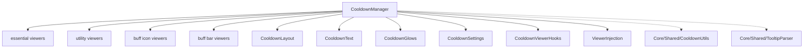

# cooldown manager

hooks into blizzard's native cooldown viewer system to provide skinned, repositionable cooldown displays.

## purpose

provides four viewer types: essential cooldowns (class rotation), utility cooldowns (defensive/utility), buff icons (tracked buffs), and buff bars (tracked buff status bars). also supports drag-and-drop injection of custom spells/items into essential/utility viewers.

## files

| file | responsibility |
|---|---|
| CooldownManager.lua | main plugin. anchor creation, settings application, viewer map, spec data helpers. |
| CooldownLayout.lua | icon grid layout engine. handles row/column math for cooldown viewers. |
| CooldownText.lua | timer/charges/stacks/keybind text rendering, font helpers, canvas preview setup. |
| CooldownGlows.lua | pandemic window glow hooks and proc glow hooks for CDM buttons. delegates all glow rendering and state management to `GlowController`. hooks `ShowPandemicStateFrame`/`HidePandemicStateFrame` for alpha-toggling and `ActionButtonSpellAlertManager` for proc glows. |
| CooldownSettings.lua | settings schema builder with sub-tabs (layout, glow, colours). |
| CooldownViewerHooks.lua | hooks into blizzard's cooldown viewer api (`C_CooldownViewer`). |
| ViewerInjection.lua | drag-and-drop item/spell injection into essential/utility viewers. creates cdm-owned frames parented to the orbit anchor (not blizzard's secure viewer) to avoid tainting the viewer's secure context; positioned relative to native icons via `afterNativeIndex` using `SetPoint(..., blizzFrame, ...)` which does not require shared parentage. per-spec persistence via `GetSpecData`/`SetSpecData`. shift-right-click removal. equipment slot tracking for trinkets (auto-updates on gear change). `/orbit flush` clears all injected icons. owns its own cursor poll (`StartCursorWatcher`) so the click-enable/drop-zone flow is self-contained — previously this was driven by a shared cursor watcher in the (now deleted) Tracked plugin's `TrackedUpdater.lua`, and the hidden coupling silently broke drop handling the moment that file was removed. delegates cursor → spell/item resolution and the `BuildInjectedItemEntry` shape to `Orbit.CooldownDragDrop` (`Core/Shared/CooldownDragDrop.lua`). |

## shared utilities (in Core/Shared/)

| file | responsibility |
|---|---|
| CooldownUtils.lua | icon dimension calculation, skin settings builder. `BuildSkinSettings` includes `iconBorder = true` to opt into `GlobalSettings.IconBorderStyle`. |
| TooltipParser.lua | tooltip scanning for active duration and cooldown duration extraction. |
| CooldownDragDrop.lua | `Orbit.CooldownDragDrop` — cursor → cooldown ability resolver, `HasCooldown`/`IsDraggingCooldownAbility`, equipment-slot lookup, cursor texture, and saved-data entry builders. ViewerInjection uses this for every drag-drop decision; previously duplicated inline. |

## architecture

## rules

- all sub-files access the parent plugin via `Orbit:GetPlugin("Orbit_CooldownViewer")` (intra-domain reference — acceptable)
- cooldown update functions run on `OnUpdate` — they must be performant (no allocations, no string concat)
- glow types are defined in `Constants.PandemicGlow.Type`. do not hardcode glow type ids
- injected icon data is stored per-character and per-spec in `OrbitDB.SpecData[charKey][specID]` via `GetSpecData`/`SetSpecData`
- this plugin has zero dependencies on the Tracked plugin (`Orbit_Tracked`). the two are fully decoupled
