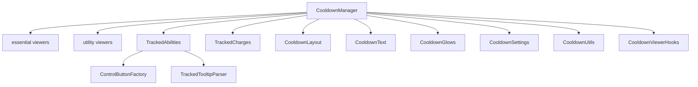

# cooldown manager

tracks ability cooldowns, active durations, and charge-based spells with visual feedback.

## purpose

provides three viewer types: essential cooldowns (class rotation), utility cooldowns (defensive/utility), and user-tracked abilities/items. also provides charge bar tracking for multi-charge spells.

## files

| file | responsibility |
|---|---|
| CooldownManager.lua | main plugin. viewer creation, essential/utility icon grids, settings application. |
| CooldownLayout.lua | icon grid layout engine. handles row/column math for cooldown viewers. |
| CooldownText.lua | timer text rendering and color curve sampling for cooldown timers. |
| CooldownGlows.lua | pandemic window glow effects (pixel, proc, autocast, button glows). |
| CooldownSettings.lua | settings schema builder with sub-tabs (layout, text, glow, visibility). |
| CooldownUtils.lua | shared utilities: icon dimension calculation, skin settings builder. |
| CooldownViewerHooks.lua | hooks into blizzard's cooldown viewer api (`C_CooldownViewer`). |
| ControlButtonFactory.lua | +/- control buttons for adding/removing child frames in edit mode. |
| TrackedAbilities.lua | user-tracked ability/item grid. drag-and-drop spell/item assignment. |
| TrackedCharges.lua | charge bar frame. tracks multi-charge spell recharge progress. |
| TrackedCanvasPreview.lua | canvas mode preview for tracked ability grids. |
| TrackedTooltipParser.lua | tooltip scanning for active duration and cooldown duration extraction. |
| KeybindSystem.lua | keybind text resolution for tracked ability icons. |

## architecture

## adding a new viewer type

1. create the viewer logic in `CooldownManager.lua` or a new sub-file
2. register a new system index in `Constants.Cooldown.SystemIndex`
3. add default settings in `DefaultProfile.lua`
4. add schema entries in `CooldownSettings.lua`
5. create canvas preview support in `TrackedCanvasPreview.lua`

## rules

- all sub-files access the parent plugin via `Orbit:GetPlugin("Orbit_CooldownViewer")` (intra-domain reference — acceptable)
- cooldown update functions run on `OnUpdate` — they must be performant (no allocations, no string concat)
- glow types are defined in `Constants.PandemicGlow.Type`. do not hardcode glow type ids
- tracked abilities use a 2d grid coordinate system (`x,y` keys). layout is driven by these coordinates
- child frame management (spawn/despawn) must update control button colors and edit mode selections
