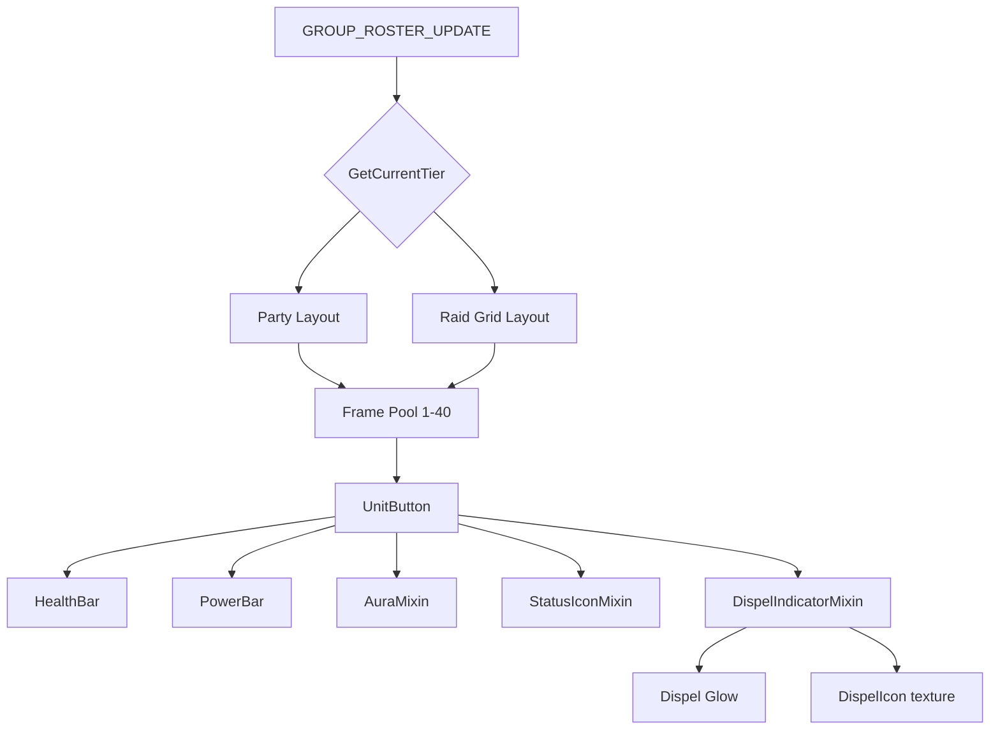

# group frames

unified unit frames for party members (party1-party4) and raid members (raid1-raid40).

## purpose

single plugin that adapts layout, sizing, and behavior based on group size tier. replaces the separate PartyFrames and RaidFrames plugins.

## tiers

| tier | members | context |
|---|---|---|
| Party | 1-5 | dungeons, arenas, open-world parties |
| Mythic | 6-20 | mythic raids, 10-man raids, rated BGs |
| Heroic | 21-30 | heroic/normal flex |
| World | 31-40 | classic raids, epic BGs |

each tier has independent settings (width, height, spacing, layout mode, component positions). settings sync between tiers is opt-in.

## files

| file | responsibility |
|---|---|
| GroupFrame.lua | main plugin. tier detection, frame creation, event handling, settings application. |
| GroupFrameSettings.lua | settings schema builder with tier selector and sub-tabs (layout, colors, indicators). |
| GroupFrameFactory.lua | unit button factory for group member frames. |
| GroupFrameHelpers.lua | layout helpers (party stacking, raid grid, border merging, sorting). |
| GroupFramePreview.lua | canvas mode and edit mode preview with mock data (adapts to current tier). |

## how it works

on group roster change or zone transition, the plugin evaluates the current tier using member count and instance constraints (e.g. mythic raids lock at 20 players via `GetInstanceInfo()` maxPlayers). if the tier changed, it saves the old tier's position, reads settings for the new tier, restores its position, and re-applies layout. party tier uses simple vertical/horizontal stacking. raid tiers use group-based grid layout with sort modes.

## position persistence

container position is stored **per tier** under `Tiers[tier].Position` (via `SaveCurrentTierPosition` / `RestoreTierPosition`). the plugin deliberately does not implement `IsSpecScopedIndex`, so it is excluded from Persistence's spec-change bulk restore ([`Core/EditMode` README](../../Core/EditMode/README.md)) — the container is authoritative over its own anchor, and the only callers that move it are initial load (`OnLoad`, to apply the saved position for the current tier on /reload), tier transitions (`CheckTierChange`), combat-end replay (`PLAYER_REGEN_ENABLED`), Edit Mode exit, and the tier dropdown in settings. `ApplySettings` must never call `RestoreTierPosition` — that call path was what caused the "snap back to default on group join" regression.

## component positions & disabled components are tier-scoped

`Tiers[tier].ComponentPositions` and `Tiers[tier].DisabledComponents` are stored per tier, routed through `TIER_KEYS` in `Plugin:GetSetting` / `Plugin:SetSetting`. canvas mode reads through `Plugin:GetComponentPositions` (which is transaction-aware) and writes via `Plugin:SetSetting` (which routes to the current tier's slot). because `plugin.defaults.ComponentPositions` does not exist at the flat level, the plugin implements `GetDefaultComponentPositions` / `GetDefaultDisabledComponents` so canvas mode's reset button resolves to the current tier's defaults from `TIER_DEFAULTS`.

## aura container layout caching

`Buffs` and `Debuffs` use a fingerprint cache (`container._auraFingerprint`) inside `AuraMixin:UpdateAuraContainer` that skips icon rebuilds when the aura set is unchanged. settings changes (position, max icons, filter density, tier flip) must invalidate this cache or the container will keep its old layout. `Plugin:ApplySettings` calls `Orbit.AuraMixin:InvalidateContainerLayout(frame)` per frame before each apply pass; do not skip this if you add a new settings-changing entry point.

## adding a new group frame feature

1. if shared with boss frames, add to core/unitdisplay as a mixin
2. if group-specific, add to `GroupFrame.lua`
3. add schema entries in `GroupFrameSettings.lua`
4. if tier-specific defaults differ, update defaults in plugin registration

## rules

- frame creation and destruction must use secure APIs (no manual show/hide in combat)
- `UpdateFrameUnits` defers to `CombatManager:QueueUpdate` during `InCombatLockdown()`
- preview frames must match live frames exactly (authoritative visual parity)
- raid frame update functions must be O(1) per frame
- aura filtering must use the optimized grid mixin (`UnitAuraGridMixin`)
- frame recycling must properly reset all state
- sort order changes must not trigger combat-unsafe operations
- selection, aggro, and dispel highlights use `Skin:ApplyHighlightBorder`
- tier transitions during combat are deferred until `PLAYER_REGEN_ENABLED`
