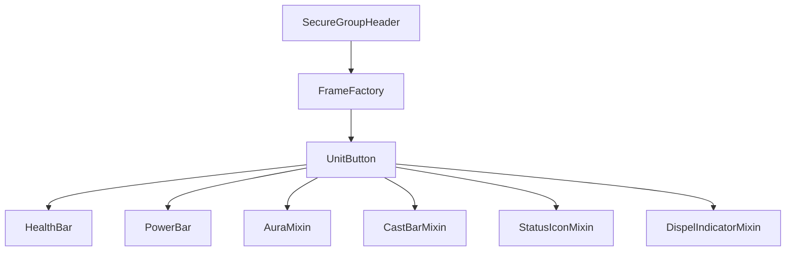

# party frames

unit frames for party members (party1-party4).

## purpose

displays health, power, auras, cast bars, dispel indicators, and status icons for party members. uses secure group headers for combat-safe frame management.

## files

| file | responsibility |
|---|---|
| PartyFrame.lua | main plugin. frame creation, event handling, aura display, settings application. |
| PartyFrameSettings.lua | settings schema builder with sub-tabs (layout, auras, colors). |
| PartyFrameHelpers.lua | layout helpers (border merging, frame stacking). |
| PartyFramePreview.lua | canvas mode preview with mock unit data. |
| FrameFactory.lua | secure unit button factory for party member frames. |

## how it works

party frames use wow's secure group header system. `FrameFactory` creates unit buttons on demand as party composition changes. all display behavior comes from core/unitdisplay mixins.

## adding a new party frame feature

1. if it's shared with raid/boss, add it to core/unitdisplay as a mixin
2. if party-specific, add it to `PartyFrame.lua` in `ApplySettings`
3. add schema entries in `PartyFrameSettings.lua`

## rules

- frame creation and destruction must use the secure header api (no manual show/hide in combat)
- preview frames must match live frames exactly (authoritative visual parity)
- party-specific aura filters go in the plugin. shared filters go in `GroupAuraFilters.lua`
- border merging between stacked frames uses `PartyFrameHelpers`
