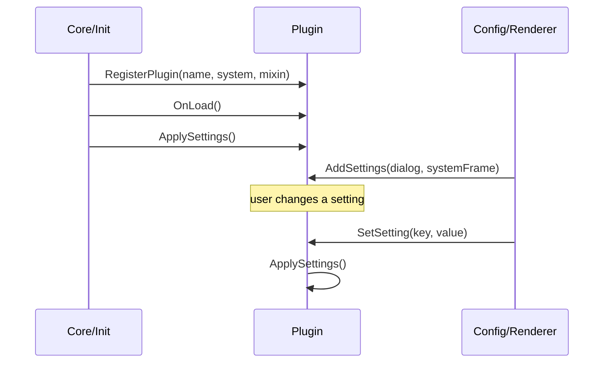

# plugins

all orbit plugins live here. each subdirectory is one plugin (one bounded context).

## purpose

plugins are the **designable** feature layer. every plugin in this directory exposes a frame the user can move, resize, or restyle through edit mode / canvas mode. always-on behaviors with no movable frame (hotkey tools, automatic tweaks) live under `QoL/` instead. the deciding question is: can the user drag it in edit mode? yes → here; no → `QoL/`.

## directory structure

```
Plugins/
  ActionBars/                 -- action bar containers, button layout, text overlays
  BossFrames/                 -- boss unit frames (1-5)
  CooldownManager/            -- cooldown viewers and charge bars (tracked abilities live in their own `Tracked/` plugin)
  CooldownViewerExtensions/   -- shared side-tab registrar for blizzard's CooldownViewerSettings (consumed by Tracked)
  DamageMeter/                -- multi-instance damage / healing / interrupt meter on top of C_DamageMeter
  Datatexts/                  -- free-floating datatext system with corner-triggered drawer
  Extras/                     -- standalone plugins that don't fit a larger bounded context (TalkingHead, MinimapButton)
  GroupFrames/                -- group unit frames (party + raid, tier-adaptive)
  MenuItems/                  -- micro menu, bag bar, queue status
  Minimap/                    -- minimap replacement with canvas-mode component layout
  RaidPanel/                  -- party / raid frame extensions and raid-marker management
  StatusBars/                 -- experience / reputation / honor progression bars with canvas text components
  Tracked/                    -- user-authored tracked ability icons and bars
  UnitFrames/                 -- player, target, focus frames and their sub-frames
```

## lifecycle



## adding a new plugin

1. create a new directory under `Plugins/` with the plugin name
2. create the main plugin file (e.g., `MyPlugin.lua`)
3. call `Orbit:RegisterPlugin("My Plugin", SYSTEM_ID, { defaults = { ... }, OnLoad = function(self) ... end })` with your plugin definition
4. implement `OnLoad()` and `ApplySettings()` methods
5. implement `function Plugin:AddSettings(dialog, systemFrame)` — receives the settings dialog and the system frame to populate; use `SchemaBuilder:AddSettingsTabs(dialog, systemFrame, schema)` to wire the standard tabs
6. add the new file to `Plugins/MyPlugin/MyPlugin.xml` as a `<Script file="NewFile.lua"/>` entry; ensure it loads after its dependencies
7. declare plugin schema defaults inline in the `defaults = { ... }` block of the options table passed to `RegisterPlugin`. Do not edit `DefaultProfile.lua` — that file is a saved-layout snapshot owned by ProfileManager, not the plugin-schema default site.

## rules

- plugins may depend on core. they must never depend on other plugins.
- inter-plugin communication must go through the eventbus, never direct calls
- each plugin manages its own frames, events, and settings
- plugin files decompose when they hold multiple responsibilities, not because they cross a line count. LOC is a smell, not a rule.
- all constants at file top. no magic numbers.
- follow the existing patterns: `PluginMixin` for settings, `Frame:AttachSettingsListener` for canvas, `Skin` for visuals
