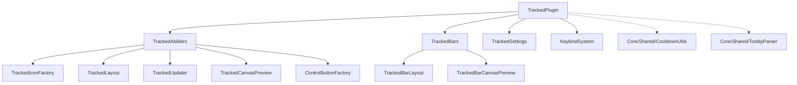

# tracked cooldowns

user-tracked ability icons and charge-based status bars for per-spec cooldown monitoring.

## purpose

provides two frame types: tracked icons (a drag-and-drop grid of spell/item cooldown icons) and tracked bars (continuous status bars for multi-charge spells). both are fully spec-scoped — each specialization maintains its own set of tracked items, positions, and anchor data.

## files

| file | responsibility |
|---|---|
| TrackedPlugin.lua | main plugin registration, lifecycle (OnLoad, ApplyAll, ApplySettings), spec-scoped setting overrides (GetSetting/SetSetting), legacy data migration, SpecData seeding. |
| TrackedSettings.lua | settings schema builder with sub-tabs for icons (layout, glow, colours) and bars (layout, colours, behaviour). |
| ControlButtonFactory.lua | +/- control buttons for adding/removing child frames in edit mode. |
| TrackedIconFactory.lua | tracked icon creation, pooling, skinning, and text styling. |
| TrackedLayout.lua | tracked icon grid layout engine, edge buttons, usability detection. |
| TrackedUpdater.lua | tracked icon cooldown state, glow, timer colour, ticker, cursor/talent watchers. |
| TrackedAbilities.lua | tracked icon anchor lifecycle, child frames, drag-and-drop, data persistence. |
| TrackedCanvasPreview.lua | canvas mode preview for tracked icon grids. |
| TrackedBarLayout.lua | tracked bar layout engine. continuous bar skinning, divider positioning. |
| TrackedBarCanvasPreview.lua | canvas mode preview for tracked bars. |
| TrackedBars.lua | tracked bar frame creation, spell restoration, charge tracking, recharge animation. |
| KeybindSystem.lua | attaches `GetSpellKeybind`/`GetItemKeybind` to both `Orbit_Tracked` and `Orbit_CooldownViewer` by delegating to `OrbitEngine.KeybindSystem`. |

## shared utilities (in Core/Shared/)

| file | responsibility |
|---|---|
| CooldownUtils.lua | icon dimension calculation, skin settings builder. |
| TooltipParser.lua | tooltip scanning for active duration and cooldown duration extraction. |

## architecture

## frame flags

| flag | meaning |
|---|---|
| `isTrackedIcon` | the tracked icon grid anchor frame |
| `isTrackedBarFrame` | a tracked bar (status bar) frame |

## spec-scoped settings

tracked data keys (`TrackedItems`, `TrackedBarSpell`, `TrackedBarChildren`, `Position`, `Anchor`) are stored per-spec in `OrbitDB.SpecData[specID]` via overridden `GetSetting`/`SetSetting`. the override checks `IsSpecScopedIndex` + `SPEC_SCOPED_KEYS` before falling through to the standard `PluginMixin` path. if spec data returns `nil` for data-only keys (`TrackedBarSpell`, `TrackedItems`, `TrackedBarChildren`), `nil` is returned directly to prevent stale global profile values from leaking.

## rules

- all sub-files access the parent plugin via `Orbit:GetPlugin("Orbit_Tracked")` (intra-domain reference — acceptable)
- this plugin has zero dependencies on the CooldownManager plugin (`Orbit_CooldownViewer`). the two are fully decoupled
- the only reference to `Orbit_CooldownViewer` is in `MigrateLegacyProfileData` for one-time data migration
- tracked icon update functions run on tickers — they must be performant (no allocations, no string concat)
- child frame management (spawn/despawn) must update control button colours and edit mode selections
- pcall is required for `HasCooldown` checks in `TrackedAbilities.lua` (WoW 12.0 secret-value API boundary)
