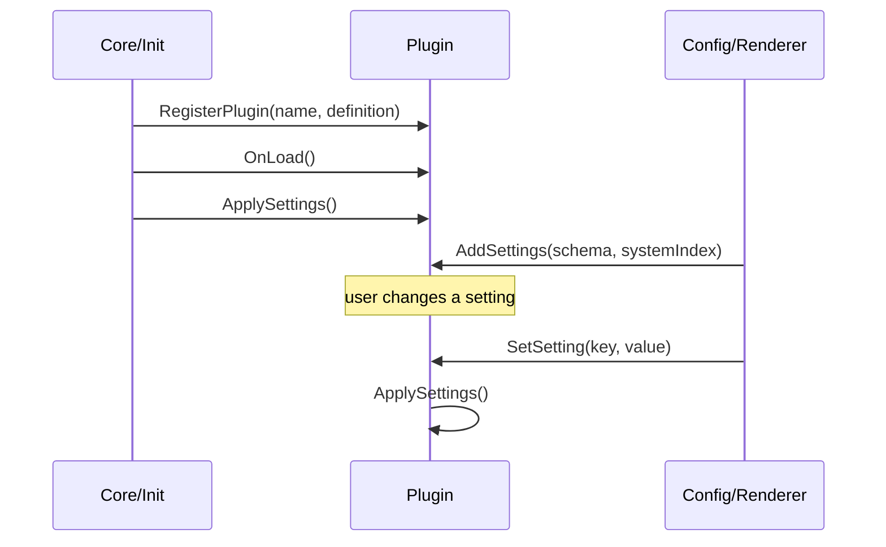

# plugins

all orbit plugins live here. each subdirectory is one plugin (one bounded context).

## purpose

plugins are the feature layer. they consume core services to implement specific hud functionality: unit frames, action bars, cooldown tracking, etc.

## directory structure

```
Plugins/
  ActionBars/       -- action bar containers, button layout, text overlays
  BossFrames/       -- boss unit frames (1-8)
  CooldownManager/  -- cooldown viewers, tracked abilities, charge bars
  MenuItems/        -- micro menu, bag bar, performance, queue status, combat timer
  Misc/             -- miscellaneous (talking head)
  PartyFrames/      -- party unit frames (1-4)
  RaidFrames/       -- raid unit frames (1-40)
  UnitFrames/       -- player, target, focus frames and their sub-frames
```

## lifecycle



## adding a new plugin

1. create a new directory under `Plugins/` with the plugin name
2. create the main plugin file (e.g., `MyPlugin.lua`)
3. call `Orbit:RegisterPlugin("Orbit_MyPlugin", { ... })` with your plugin definition
4. implement `OnLoad()` and `ApplySettings()` methods
5. add settings via `AddSettings(schema, systemIndex)` if needed
6. add all files to `Orbit.toc` in the plugins section
7. add the plugin to `DefaultProfile.lua` with default settings

## rules

- plugins may depend on core. they must never depend on other plugins.
- inter-plugin communication must go through the eventbus, never direct calls
- each plugin manages its own frames, events, and settings
- plugin files must not exceed ~1000 loc. decompose into sub-files when approaching this limit.
- all constants at file top. no magic numbers.
- follow the existing patterns: `PluginMixin` for settings, `Frame:AttachSettingsListener` for canvas, `Skin` for visuals
