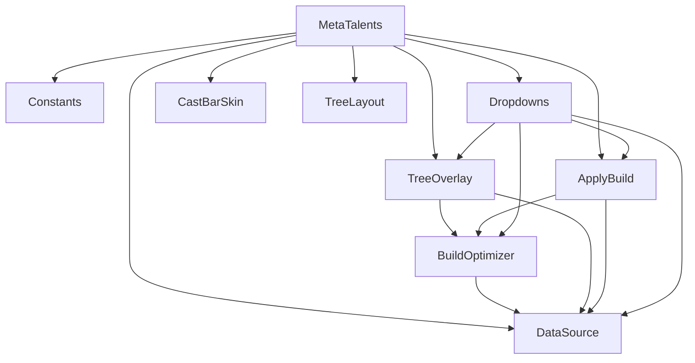

# meta talents

overlays WCL Top 100 talent pick-rates on the Blizzard talent tree, then lets the player import a budget-aware greedy build with one click.

## purpose

a data-driven talent tree QoL. source data comes from `OrbitData` (a LoD addon auto-generated by CI) and is indexed by class, spec, content (M+ dungeon / raid boss), and difficulty. the module paints a heatmap badge under every visible talent node, marks meta/off-meta paths with red or green shape glows, appends a pick-rate line to talent tooltips, and exposes an "Apply Orbit Loadout" button that imports a greedily-optimized build into a dedicated `Orbit Loadout` config.

## files

| file | responsibility |
|---|---|
| Constants.lua | seeds the `Orbit.MetaTalents` namespace, all shared constants, WCL tier colors, and `HeatmapColor(pct)`. must load first. |
| DataSource.lua | LoD dataset binding, class/spec key cache, content/difficulty routing, spell-id reverse cache for the tooltip hook, spec-change watcher. |
| BuildOptimizer.lua | budget-aware greedy loadout algorithm. produces three parallel outputs: import entries array, entryID meta-set (for overlay glow), and a per-nodeID descriptor table (for the apply button match check). |
| TreeOverlay.lua | per-button heatmap pipeline: badge creation, red/green shape glow, and the tooltip post-call that appends the WCL pick-rate line to spell tooltips. |
| ApplyBuild.lua | owns the "Apply Orbit Loadout" button: the import action, the match-state evaluator, the debounced event watcher, and the **level 81+ gate**. |
| Dropdowns.lua | footer widgets on the TalentsFrame: content picker, difficulty picker, heatmap toggle, apply button. `RefreshMetaUI` is the single invalidation funnel. |
| CastBarSkin.lua | reskins `OverlayPlayerCastingBarFrame` ("Applying Talents") with a 2px gold fill and a rotating star-spark. |
| TreeLayout.lua | SpendText rewriting (capstone pip / capstone master / standard), apex button relocation under the hero tree, capstone pip row flattening. |
| MetaTalents.lua | orchestrator. lifecycle (`Enable`/`Disable`), Blizzard addon load chaining, auto-enable on login. |

## architecture

dependency direction is inward-only: `MetaTalents.lua` wires everything up, Dropdowns/ApplyBuild/TreeOverlay depend on Build+Data+Constants, and Constants has no dependencies.

## namespace

every file attaches to `Orbit.MetaTalents` via a sub-table:

| sub-table | owner file |
|---|---|
| `Orbit.MetaTalents.Constants` | Constants.lua |
| `Orbit.MetaTalents.Data` | DataSource.lua |
| `Orbit.MetaTalents.Build` | BuildOptimizer.lua |
| `Orbit.MetaTalents.Overlay` | TreeOverlay.lua |
| `Orbit.MetaTalents.Apply` | ApplyBuild.lua |
| `Orbit.MetaTalents.Dropdowns` | Dropdowns.lua |
| `Orbit.MetaTalents.CastBarSkin` | CastBarSkin.lua |
| `Orbit.MetaTalents.TreeLayout` | TreeLayout.lua |

the public lifecycle stays on the root table: `MT:Enable()` / `MT:Disable()` / `MT.UpdateApplyButtonState`. `MT._applyBtn` and `MT._toggleBtn` are the footer widget frames owned by `Dropdowns.lua`.

## the three build outputs

`Build.Compute()` returns three parallel collections from a single pass:

| return | shape | consumer |
|---|---|---|
| `importEntries` | array of `{ nodeID, ranksGranted, ranksPurchased, selectionEntryID }` | `C_ClassTalents.ImportLoadout` |
| `metaSet` | `{ [entryID] = true }` | TreeOverlay red/green glow decision |
| `metaNodes` | `{ [nodeID] = { entryID, ranks, tiered, choice } }` | ApplyBuild match-state check |

`metaNodes` exists to fix a tiered-node false-negative: for a tiered node, `AddEntry` writes every tier `entryID` into `metaSet`, but `nodeInfo.activeEntry` only ever holds one live entry at a time. a naive entry-walker would always see a mismatch. `metaNodes` gives the match checker one descriptor per node so it can compare `activeRank` directly for tiered nodes.

## level gate

apply loadout is disabled under `Constants.MIN_APPLY_LEVEL = 81`. at low level the hero tree is not unlocked and the capstone row is unavailable, so the greedy fill would overshoot the real point budget and produce a nonsense import. the gate is enforced in two places:

- `Apply.ApplyMetaBuild` — early-returns with a user-facing print.
- `Apply.UpdateApplyButtonState` — sets `btn._belowLevel = true`, desaturates the icon, alpha 0.4; the tooltip branch in `Dropdowns.CreateApplyButton` reads `_belowLevel` and shows "Orbit Loadout (Level 81+)".

`PLAYER_LEVEL_UP` is registered on the apply state watcher so dinging 81 flips the button to enabled without requiring a talent frame reopen. the heatmap, tooltip hook, and tree glow all remain functional at low level — only the import action is gated.

## hook ordering

the Blizzard load chain matters:

1. `Blizzard_SharedTalentUI` loads → hook `TalentButtonArtMixin.UpdateStateBorder` for per-button heatmap application.
2. Inside that callback, chain `Blizzard_PlayerSpells` → hook `PlayerSpellsFrame.TalentsFrame.UpdateTreeCurrencyInfo` and call `CastBarSkin.Apply`.
3. `TreeLayout.HookSpendText` / `HookApplyPosition` / `HookCapstoneTrack` run once SharedTalentUI is live.
4. `Dropdowns.Setup` attempts an immediate build, and `ApplyPosition` also calls it every frame it runs in case the TalentsFrame wasn't ready yet.

`MT._hooked` guards re-entry; `MT._dropdownsSetup` guards widget duplication.

## data refresh flow

cache invalidation has a single entry point: `Dropdowns.RefreshMetaUI`. any action that could change the pick-rate surface (content change, difficulty change, heatmap toggle) calls it, which:

1. marks the spell-id tooltip cache dirty (`Data.MarkSpellCacheDirty`)
2. invalidates the build caches (`Build.Invalidate`)
3. re-applies the heatmap to every visible button, including capstone pip children
4. pokes the apply button state (`MT.UpdateApplyButtonState`)

spec changes hit a parallel path via `DataSource.lua`'s `specWatcher`, which splits dispatch on event name — `PLAYER_SPECIALIZATION_CHANGED` checks `arg1 == "player"`, `PLAYER_ENTERING_WORLD` does not (its first arg is `isInitialLogin`, not a unit token).

## rules

- `Constants.lua` **must** load first — every sibling pulls values out of it.
- every file grabs its dependencies at the top via locals (`local C = MT.Constants` etc). never late-bind from inside a function unless the dependency is optional.
- `Build.Compute` is the only function that should write to the build cache. call `Build.GetMetaSet` / `Build.GetMetaNodes` / `Build.Compute` — never read the cache directly.
- any new UI-refreshing dropdown/toggle/button routes through `Dropdowns.RefreshMetaUI` for cache invalidation.
- keep `Apply.ApplyMetaBuild` as the single funnel for the `ImportLoadout` call. the match-state checker and the import action are deliberately in the same file because they share the level gate.
- tree-layout hooks belong in `TreeLayout.lua`; cast bar hooks belong in `CastBarSkin.lua`. resist inlining them into the orchestrator.
